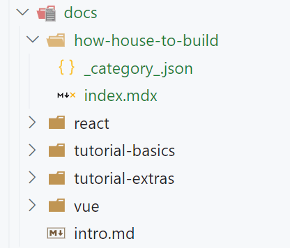
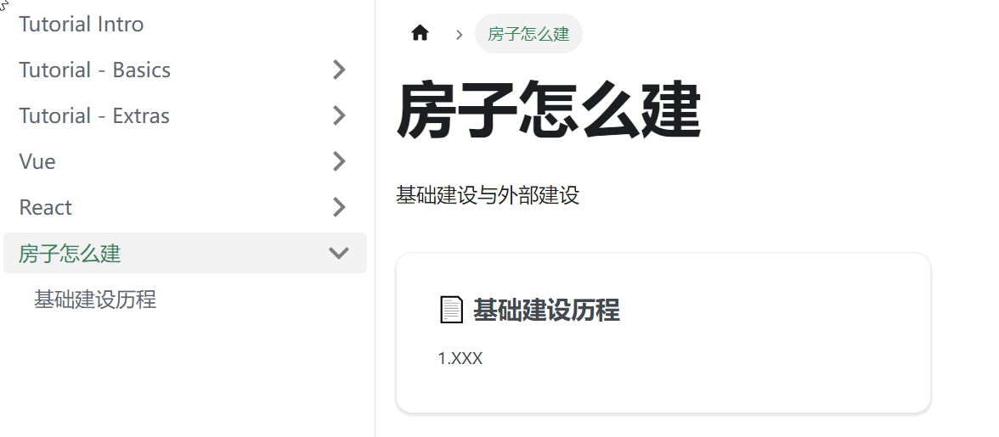
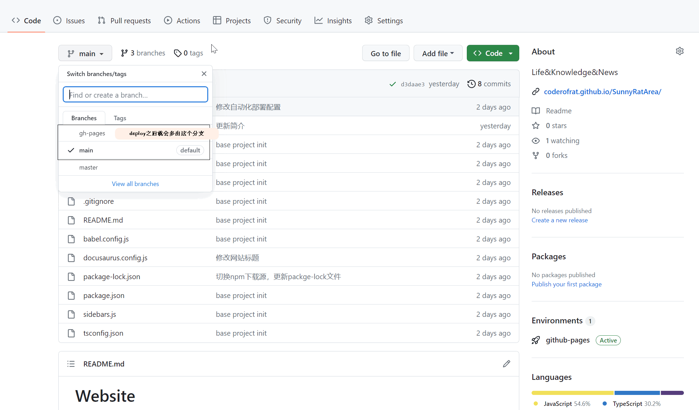
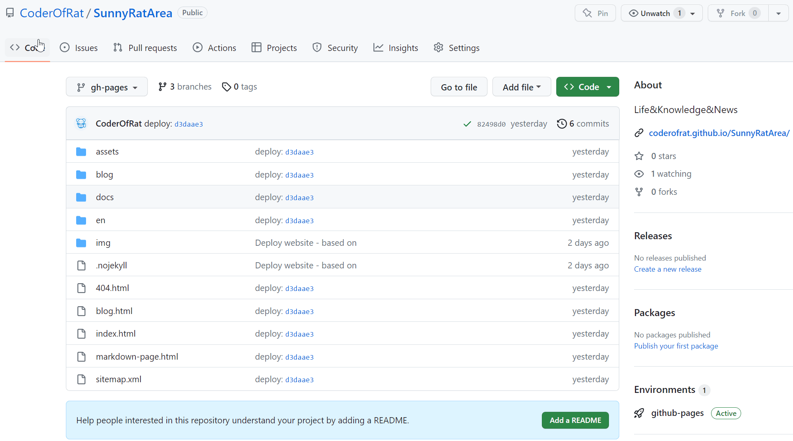
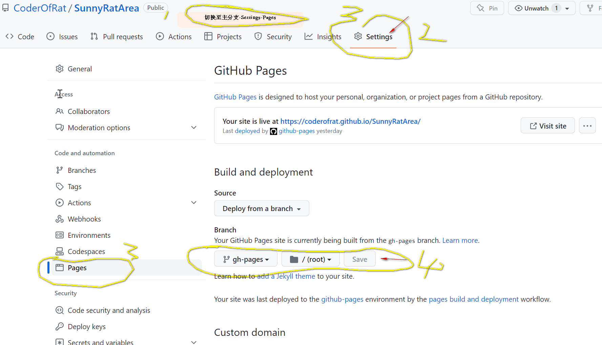
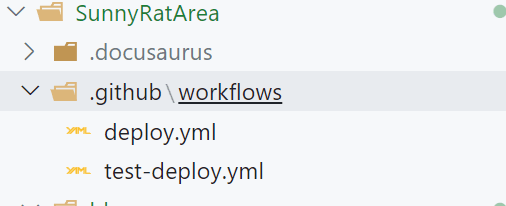
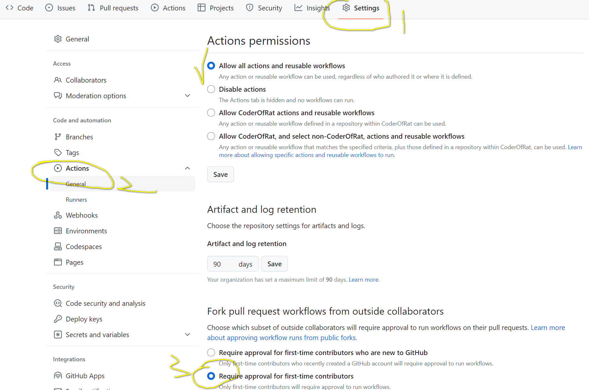
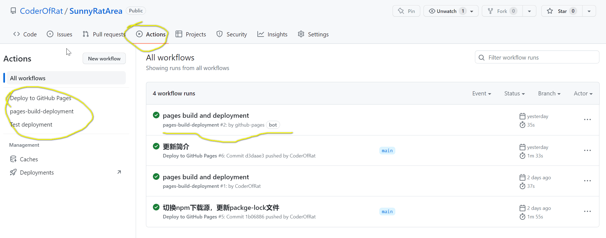

## 方案1 访问官网，根据部署文档进行部署
[Docusaurus 官网](https://docusaurus.io/)

## 方案2 跟随此篇博客，按步骤部署
### 第一步：环境准备
1. NodeJs版本：16.14.0以上<br/>
2. 执行如下命令，构建支持编写typescript组件的网站经典模板
```bash
npx create-docusaurus@latest my-website classic --typescript
```
3. 本地预览
```bash
npm [run] start | yarn start
```
4. 需要安装git，保证已经设置好自己的git账号信息
### 第二步：配置
1. 配置导航菜单 `sidebars.js`
```js 
const sidebars = {
  // By default, Docusaurus generates a sidebar from the docs folder structure
  tutorialSidebar: [
    { type: "autogenerated", dirName: "." },
  ],
  vueSidebar: [
    { type: "autogenerated", dirName: "vue" },
  ],
  reactSidebar: [
    { type: "autogenerated", dirName: "react" },
  ],
  basicProSidebar: [
    { type: "autogenerated", dirName: "how-house-to-build" },
  ]
};
```

>值得注意的是，每个文件夹下都放了一个配置文件`_category_.json`，主要声明此文件夹下归纳为同一个分类

```json
{
  "label": "房子怎么建",
  "position": 6,
  "link": {
    "type": "generated-index",
    "description": "基础建设与外部建设"
  }
}
```



2. 配置程序参数文件 `docusaurus.config.js`
```js
// 只保留了关键配置
const config = {
  title: '慵懒笔记',
  tagline: '岁月风霜三十载，百味人生唯己知；忆往昔，年少轻狂时，俱远矣；看今日，而立之年始，继拼之！',
  favicon: 'img/favicon.png',
  // Set the production url of your site here
  url: 'https://coderofrat.github.io',
  baseUrl: '/SunnyRatArea/',
  // GitHub pages deployment config.
  // If you aren't using GitHub pages, you don't need these.
  organizationName: 'CoderOfRat', // Usually your GitHub org/user name.
  projectName: 'SunnyRatArea', // Usually your repo name.
  trailingSlash: false,
  onBrokenLinks: 'throw',
  onBrokenMarkdownLinks: 'warn',
  // Even if you don't use internalization, you can use this field to set useful
  // metadata like html lang. For example, if your site is Chinese, you may want
  // to replace "en" with "zh-Hans".
  i18n: {
    defaultLocale: 'zh-Hans',
    locales: ['zh-Hans','en'],
  },
  themeConfig:
    /** @type {import('@docusaurus/preset-classic').ThemeConfig} */
    ({
      // Replace with your project's social card
      image: 'img/docusaurus-social-card.jpg',
      navbar: {
        title: 'SunnyRatArea',
        logo: {
          alt: 'A Rat',
          src: 'img/logo.svg',
        },
        items: [
          {
            type: 'docSidebar',
            sidebarId: 'tutorialSidebar',
            position: 'left',
            label: '所有搬砖的汗水',
          },
          {
            type: 'docSidebar',
            sidebarId: 'vueSidebar',
            position: 'left',
            label: 'Vue砖头们',
          },
          {
            type: 'docSidebar',
            sidebarId: 'reactSidebar',
            position: 'left',
            label: 'React砖头们',
          },
          {
            type: 'docSidebar',
            sidebarId: 'basicProSidebar',
            position: 'left',
            label: '房子怎么建',
          },
          {to: '/blog', label: '搬砖侠的日常', position: 'left'},
          {
            href: 'https://github.com/CoderOfRat',
            label: 'GitHub',
            position: 'right',
          },
        ],
      },
    }),
};
```

3. 推送部署，此次操作将会涉及**github项目建立**、**首次自动化构建静态资源并推送到gh-pages分支**
首先，你需要在github建立一个承载这个项目的仓库，名字你可以自定义，然后你需要同步修改第2步中配置文件的`baseUrl`和`projectName`,
分别是`/仓库名/`和`仓库名`，然后拷贝项目克隆地址，到本地项目做线上线下仓库关联，执行命令如下：
```bash
git init
git config add remote origin https://XXX.git
git push -u origin 你的主分支名（应为main或者master）
# 根据提示输入账户信息进行同步且推送即可
# 保证上述无误后，线上也同步了你本地的内容，即可执行：
USE_SSH=true npm run deploy
or
USE_SSH=true yarn deploy
or
GIT_USER=CoderOfRat npm run deploy
or
GIT_USER=CoderOfRat yarn deploy
```
等待执行完成，即可完成首次静态资源推送




:::tip
如果想实现自动化部署
新建文件夹如下


`deploy.yml`
```yml
name: Deploy to GitHub Pages

on:
  push:
    branches:
      - main
    # Review gh actions docs if you want to further define triggers, paths, etc
    # https://docs.github.com/en/actions/using-workflows/workflow-syntax-for-github-actions#on

jobs:
  deploy:
    name: Deploy to GitHub Pages
    runs-on: ubuntu-latest
    steps:
      - uses: actions/checkout@v3
      - uses: actions/setup-node@v3
        with:
          node-version: 18
          cache: npm

      - name: Install dependencies
        run: npm ci
      - name: Build website
        run: npm run build

      # Popular action to deploy to GitHub Pages:
      # Docs: https://github.com/peaceiris/actions-gh-pages#%EF%B8%8F-docusaurus
      - name: Deploy to GitHub Pages
        uses: peaceiris/actions-gh-pages@v3
        with:
          github_token: ${{ secrets.GITHUB_TOKEN }}
          # Build output to publish to the `gh-pages` branch:
          publish_dir: ./build
          # The following lines assign commit authorship to the official
          # GH-Actions bot for deploys to `gh-pages` branch:
          # https://github.com/actions/checkout/issues/13#issuecomment-724415212
          # The GH actions bot is used by default if you didn't specify the two fields.
          # You can swap them out with your own user credentials.
          user_name: CoderOfRat
          user_email: 1404616446@qq.com
```

`test-deploy.yml`
```yml
name: Test deployment

on:
  pull_request:
    branches:
      - main
    # Review gh actions docs if you want to further define triggers, paths, etc
    # https://docs.github.com/en/actions/using-workflows/workflow-syntax-for-github-actions#on

jobs:
  test-deploy:
    name: Test deployment
    runs-on: ubuntu-latest
    steps:
      - uses: actions/checkout@v3
      - uses: actions/setup-node@v3
        with:
          node-version: 18
          cache: npm

      - name: Install dependencies
        run: npm ci
      - name: Test build website
        run: npm run build
```


这样每次推送、合并、PR都会自动化更新gh-pages的内容，实现自动化部署啦~

:::
