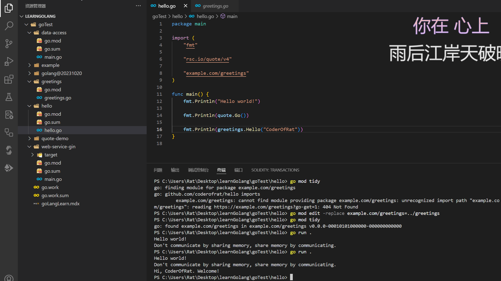
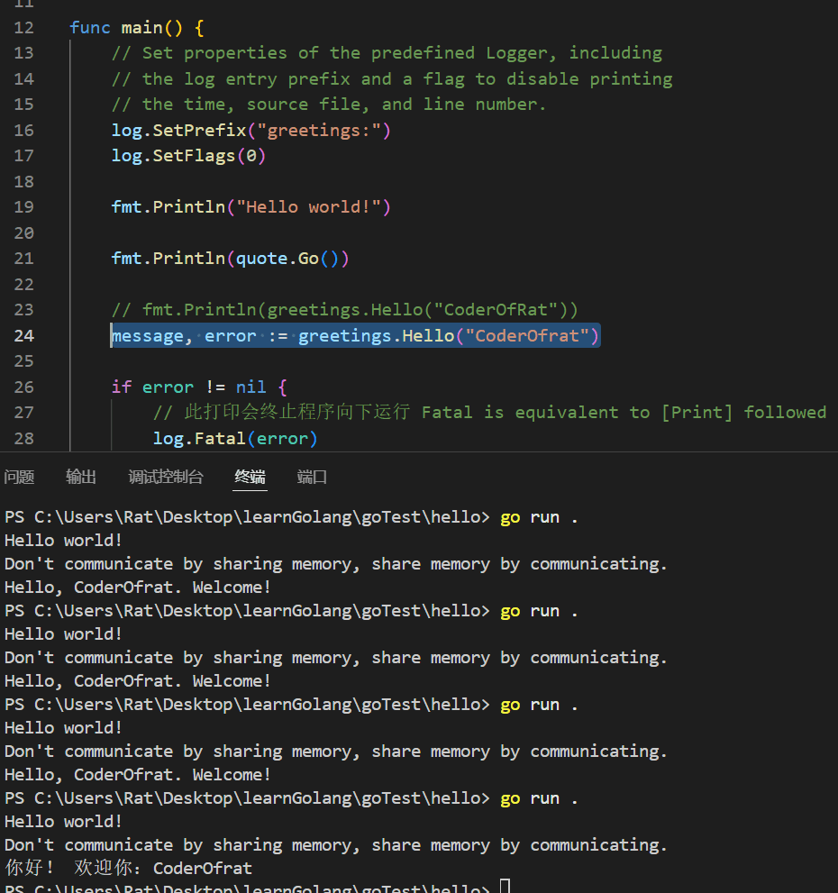
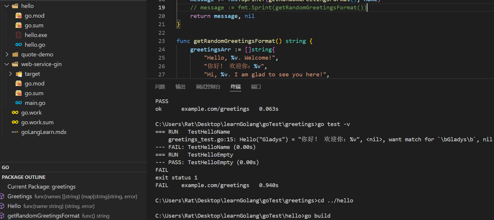
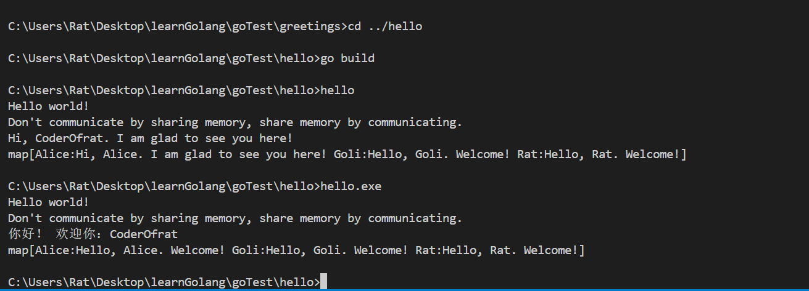
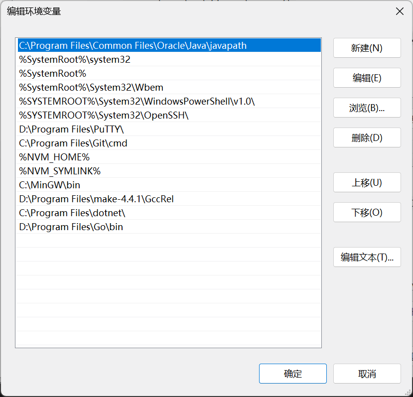
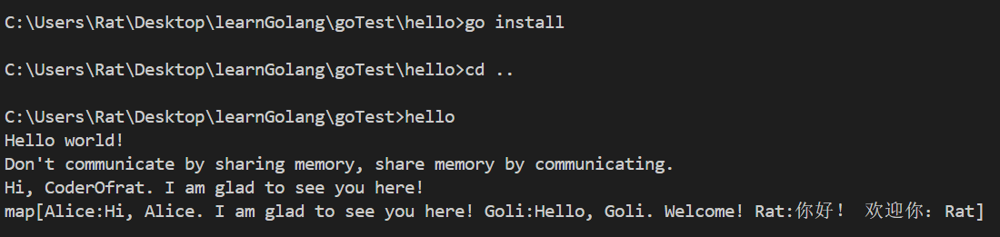
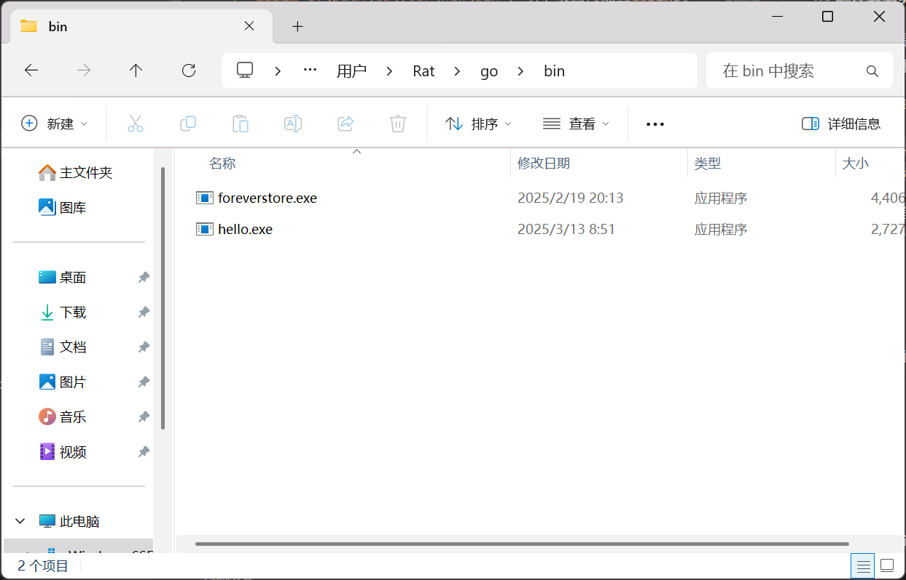

# GoLang Learning
## Go编码前置知识
> go以包的形式组织代码，一个包（package）代表一个文件夹下一系列源文件的集合，他们会被一起编译，被定义在同个包下的方法（functions）、类型（types）、变量（variables）、常量（constants）,在该工作区下是共享可见的。

一个存储库，可以包含一个或者多个模块（modules）,一个模块是一系列一起发布的相关go包（packages）的集合。一个go存储库，通常只包含一个模块（module）,位于存储库的根目录。根目录下有个名为`go.mod`的文件声明了该模块的模块路径：模块内所有包的导入路径前缀。该模块包含其下级具有自己的`go.mod`文件的直属模块，不含直属模块下级包含`go.mod`文件的子目录。***（这个存疑，感觉文档写的英语有点绕，等后面在看到合适的解释，再修改）***

go工作空间，允许你使用本地依赖，类似于Monorepo模式下的工作空间，本地依赖可以最为实际依赖进行引入。

go包的导入path：`go.mod`文件中的首行`module example.com/web-service-gin`，不仅声明了包的名字，也表示了该包的下载地址应为：	`https://example.com/web-service-gin`。

在指定module内执行`go install`、`go install .`、`go install 该包的module path`，会build该包为二进制可执行文件到`GOBIN目录下`，如需修改/重置`GOBIN`环境变量配置，可通过以下命令：
``` shell
# 默认为 linux等:$HOME/go/bin windows: /users/XXX/go/bin
# 修改
go env -w GOBIN=/somewhere/else/bin
# 重置
go env -u GOBIN
```
> `go install`这样的命令，需要在module包中执行，否则会报错，要区别于前端的`npm install`；为了方便起见，go 命令接受相对于工作目录的路径，所以在module包内指定`go.mod`位置，执行`go install`、`go install .`、`go install 该go.mod声明的module path`是等效的。

**环境变量`GOPATH`指定了go程序的工作区位置，`GOBIN`环境变量也可配置为：`%GOPATH%/bin`**
添加go工作区位置到系统环境变量，则工作区内bin目录的二进制可执行文件即可快速在任何位置执行
``` shell
# Windows users should consult /wiki/SettingGOPATH 其实就是将 /users/xxx/go目录添加到环境变量
# for setting %PATH%. -- linux等
export PATH=$PATH:$(dirname $(go list -f '{{.Target}}' .))
hello
# Hello, world.
```

包名（module path）的命名规范，应可以直接匹配为：HTTPS URL，这样更有利于别人或者自己引用，也有助于代理服务收录。

如何引用本地包呢，可以创建一个本地包的形式进行演示：
在hello目录新建morestrings目录，该目录下新建`revers.go`,并键入如下代码：
``` go
// 引用官网示例
// Package morestrings implements additional functions to manipulate UTF-8 encoded strings, 
// beyond what is provided in the standard "strings" package.
package morestrings

// ReverseRunes returns its argument string reversed rune-wise left to right.
func ReverseRunes(s string) string {
    r := []rune(s)
    for i, j := 0, len(r)-1; i < len(r)/2; i, j = i+1, j-1 {
        r[i], r[j] = r[j], r[i]
    }
    return string(r)
}
```
> 由于我们编写的function使用了upper-case形式命名，所以他是一个被导出的方法，可以被引入他的其他包使用。

接下来可以在当前目录执行`go build`，这不会产生输出文件。相反，它会将编译后的包保存在本地构建缓存中。--这样我们就可以在其他包进行直接引用
然后我们可以在hello目录，新建主入口文件`hello.go`,并编写代码如下：
``` go
package main

import (
    "fmt"

    "example/user/hello/morestrings"
)

func main() {
    fmt.Println(morestrings.ReverseRunes("!oG ,olleH"))
}
```

随后执行`go install`，更新可执行二进制执行文件，完成后执行`hello`命令

``` shell
hello
# Hello, Go!
```

引入远程的包，则需要引入后执行`go mod tidy`进行远程包下载（已下载过的包就不会再次下载了），此命令还会删除没用到的包。

`go mod tidy`下载的包会被下载到`GOPATH`目录下的pkg/mod子目录中，被下载到这里的module，会共享到其他modules（如果引入的版本号一致）；所以此目录中的文件都是只读的。如需移除所有下载过的modules，则需要执行：
``` shell
go clean -modcache
```

Go 已经内部集成了一个由 go test 命令和测试包组成的轻量级测试框架。如需编写测试代码，可以参考如下官方提供代码：
``` go
package morestrings

import "testing"

func TestReverseRunes(t *testing.T) {
    cases := []struct {
        in, want string
    }{
        {"Hello, world", "dlrow ,olleH"},
        {"Hello, 世界", "界世 ,olleH"},
        {"", ""},
    }
    for _, c := range cases {
        got := ReverseRunes(c.in)
        if got != c.want {
            t.Errorf("ReverseRunes(%q) == %q, want %q", c.in, got, c.want)
        }
    }
}
```

然后在当前测试模块目录，执行以下命令：

``` shell
cd /hello/morestrings
go test
# PASS
# ok  	example/user/hello/morestrings 0.165s
```

*清楚以上内容后，对go的开发模式就有了基本来了解，接下来进一步深入go的基础开发过程，最后进阶web框架*

---

## Golang官网入门文档
### 1. Go程序包获取/安装/卸载
- 最简单的方法就是下载指定平台的二进制安装包进行安装 `https://go.dev/doc/install`
- 其次是源码编译安装 这个官网有详细文档，新学者不建议，真正熟悉golang后，如需开发高效基于go核心的包，再进行此方面研读
- 多版本管理，需要gitshell支撑，执行如下命令

``` shell
go install golang.org/dl/go1.10.7@latest

go1.10.7 download

go1.10.7 version
## go version go1.10.7 linux/amd64

go1.10.7 env GOROOT
## 可以查看此版本的环境变量目录
## 要卸载指定版本的go, 只需要通过此版本的环境变量找到指定目录的二进制包进行直接删除 更多平台卸载方式，可以参考官方
```
### 2. 开始使用go进行代码编写
1. 初始化工作空间

<p>在常用的工作目录新建文件夹，在此文件夹位置打开cmd/shell/bash等，执行如下脚本</p>

``` shell
mkdir hello
cd hello
# go mod 可以进行golang项目工作空间初始化工作
go mod init example/hello
# go: creating new go.mod: module example/hello
# go: to add module requirements and sums:
        # go mod tidy
```
执行后会发现，目录中生成了`go.mod`文件,
随后在当前目录新建`hello.go`文件，编写如下入门代码:
``` go
package main

import ("fmt")

func main() {
    fmt.Println("Hello World!")
}
```
保存后，终端执行`go run .`,终端打印`Hello World!`,标志着完成了go的第一个程序运行
> 注意点1：引入go包的方式，`import 'fmt'`、`import ('a/exmaple/mod' \n b/example/mod)` <br/> 
注意点2：main 函数一个包里只会有一个主入口函数

### 3. 调用外部包中的代码（导入模块、或内部模块）
> <a href="https://pkg.go.dev">go生态包检索：pkg.go.dev</a>

当开发过程中，需要使用其他已开发好的其他模块，我们需要这样做：

1. 在上述生态包检索页面搜索需要的包
2. 通过import关键字声明引入
3. 执行`go mod tidy`,等待模块下载完毕，即可在代码中使用

代码示例：

``` go
package main

import (
	"fmt"

	"rsc.io/quote/v4"
)

func main() {
	fmt.Println("Hello world!\n")

	fmt.Println(quote.Go())
}
```
> go mod tidy: 下载/关联/删除 当前目录下的依赖模块 类似`npm install`；国内执行`go mod tidy`一般会下载失败，这时候我们修改默认代理环境变量，需要找到go的安装目录中的`go.env`文件进行修改，修改如下：

``` bash
# GOPROXY=https://proxy.golang.org,direct
GOPROXY=https://goproxy.cn,direct ## 使用七牛云代理
# 如果失效，自行百度
```

或者执行以下脚本设置 下述方式优先级大于go.env文件配置，执行下面的脚本后，go.env文件的下载代理可以不用修改

``` shell
go env -w GO111MODULE=on
go env -w GOPROXY=https://goproxy.cn,direct

# windows 环境亦可通过PowerShell设置环境变量，就不用执行上述脚本了,
$env:GO111MODULE = "on"
$env:GOPROXY = "https://goproxy.cn"
```

完成上述的编码及配置，并下载完毕后，执行go mod tidy,等待下载/或者关联完成后，执行`go run .`，即可看到打印出有关通信的语录

### 4. 创建本地Module
> Go code is grouped into packages, and packages are grouped into modules. 
您的模块(go.mod)指定运行代码所需的依赖项(first require)，还包括 Go 版本(go 1.24.0)和它所需的其他模块集(second require)。

- 进入工作目录

``` shell
cd yourworkspaceforgo
```

- 创建Go 模块代码目录

``` shell
mkdir greetings
```

- 使用`go mod init xxx`，初始化模块，类似于`npm init -y xxx`

``` shell
go mod init example.com/greetings
# go: creating new go.mod: module example.com/greetings
```

> `go mod init` 命令创建一个 `go.mod` 文件来跟踪代码的依赖关系，该文件中目前只包含 `模块名` 和 `当前模块支持的go版本号` 的相关声明；
但是当你添加依赖项时，`go.mod` 文件将列出你的代码所依赖的版本。这可以保持构建的可重复性，并让你直接控制要使用的模块版本。

- 在此目录中创建 `greetings.go` 文件，然后输入如下代码：

``` go
package greetings

import "fmt"

// Hello returns a greeting for the named person.
func Hello(name string) string {
    // Return a greeting that embeds the name in a message.
    message := fmt.Sprintf("Hi, %v. Welcome!", name)
    return message
}
```

> 在Go中，名称以大写字母开头的函数可以被不在同一包中的函数调用。
在 Go 中，:= 运算符是一种在一行中声明和初始化变量的快捷方式（Go 使用右侧的值来确定变量的类型）。
从长远来看，您可能会将其写成：

``` go
var message string

message = fmt.Printf("Hi, %v. Welcome!", name)
```

*以上内容，创建了第一个向外暴露函数的module，接下来我们可以在其他模块引入我们创建的module。*


#### 4.1 在go代码中使用其他模块的代码

新建模块目录 `hello`，初始化后，引入之前创建的module

``` shell
cd ..

mkdir hello

cd hello

go mod init github.com/coderofrat/hello
```
新建`hello.go`,键入如下代码：

```go
package main

import (
	"fmt"

	"rsc.io/quote/v4"

	"example.com/greetings"
)

func main() {
	fmt.Println("Hello world!")

	fmt.Println(quote.Go())

	fmt.Println(greetings.Hello("CoderOfRat"))
}
```
此时执行`go mod tidy`，将会提示找不到`example.com/greetings`模块：

> 由于引入的`example.com/greetings`包尚未发布，因此为了本地适用此模块，我们需要进行路径指定，让依赖模块可以索引到本地模块。
如果要使用的包，尚未发布，比如是自己本地的module，执行`go mod edit -replaace example.com/greetings=../greetings`,可以告诉go tools针对此module需要重定向索引位置。该命令指定了应将 example.com/greetings 替换为 ../greetings，以便定位依赖项。

```shell
go mod edit -replace example.com/greetings=../greetings
```

运行该命令后，`hello`目录中的`go.mod`文件应包含一个`replace`指令：
> 模块路径后面的数字是伪版本号——用来代替语义版本号所生成的数字

``` sh
module github.com/coderofrat/hello

go 1.24.0

require (
	example.com/greetings v0.0.0-00010101000000-000000000000
	rsc.io/quote/v4 v4.0.1
)

require (
	golang.org/x/text v0.22.0 // indirect
	rsc.io/sampler v1.3.0 // indirect
)

replace example.com/greetings => ../greetings
```

从 `hello` 目录中的命令提示符中，运行 `go mod tidy` 命令来同步 `example.com/hello` 模块的依赖项，添加代码所需但尚未在模块中跟踪的依赖项。

``` shell
$ go mod tidy
go: found example.com/greetings in example.com/greetings v0.0.0-00010101000000-000000000000
```

执行后，`go.mod` 文件中的内容如下：
``` sh
module example.com/hello

go 1.24.0

replace example.com/greetings => ../greetings

require example.com/greetings v0.0.0-00010101000000-000000000000
```

随后执行`go run .`,输出如下：
``` shell
go run .
# Hello world!
# Don't communicate by sharing memory, share memory by communicating.
# Hi, CoderOfRat. Welcome!
```



*至此，已经完成了两个可运行模块的编写/运行，接下来我们来给代码添加一些错误处理逻辑*

#### 4.2 错误处理逻辑
代码的错误处理逻辑，是让go代码保持健壮的基本要素，我们给之前的`greetings`模块添加错误处理的相关代码：

``` go
package greetings

import (
	"errors"
	"fmt"
)

// Hello returns a greeting for the named person.
func Hello(name string) (string, error) {
	// 如果names输入为空字符串，则返回空字符串，抛出异常信息(异常信息开头首字母不允许大写)
	if name == "" {
		return name, errors.New("empty name provided")
	}
	// Return a greeting that embeds the name in a message.
	message := fmt.Sprintf("Hi, %v. Welcome!", name)
    // 在成功返回时添加 nil（表示没有错误）作为第二个值。这样，调用者就可以看到函数成功了。
	return message, nil
}
```
> go 代码是**静态类型编译型**语言，因此错误的程序输入不会编译成功，所以异常处理一般不考虑此方面。

然后我们在使用更新后的`greetings`包的时候，就需要添加对应的异常捕获代码：
``` go
package main

import (
	"fmt"
	"log"

	"rsc.io/quote/v4"

	"example.com/greetings"
)

func main() {
	// Set properties of the predefined Logger, including
	// the log entry prefix and a flag to disable printing
	// the time, source file, and line number.
    // 配置日志包以在其日志消息的开头打印命令名称（“greetings:”），不带时间戳或源文件信息。
	log.SetPrefix("greetings:")
	log.SetFlags(0)

	fmt.Println("Hello world!")

	fmt.Println(quote.Go())

	// fmt.Println(greetings.Hello("CoderOfRat"))
	message, error := greetings.Hello("CoderOfRat")

	if error != nil {
		// 此打印会终止程序向下运行 Fatal is equivalent to [Print] followed by a call to os.Exit(1).
		log.Fatal(error)
	}

	// 没有错误，打印message返回信息
	fmt.Println(message)
}
```
``` shell
go run .
# Hello world!
# Don't communicate by sharing memory, share memory by communicating.
# Hi, CoderOfRat. Welcome!
```

接下来，我们将`greetings.Hello()`方法内参数传递空字符串，再次执行：
``` go
message, error := greetings.Hello("")
```

``` shell
go run .
# Hello world!
# Don't communicate by sharing memory, share memory by communicating.
# greetings:empty name provided
# exit status 1
```
此时执行到此方法时，后续代码对异常情况进行了打印并终止当前程序的处理。

*完成该小结，我们错略了解了简单的错误处理方式，接下来我们要通过切片（slice）完善上述greetings模块，
使之可以返回一个随机的greeting字串*

#### 4.3 利用切片（slice），实现随机打印欢迎语
> 切片类似于数组，不同之处在于其大小会随着您添加和删除项目而动态变化。切片是 Go 中最有用的类型之一。

进一步修改`greetings/greetings.go`中的代码：
``` go
package greetings

import (
	"errors"
	"fmt"

	"math/rand"
)

// Hello returns a greeting for the named person.
func Hello(name string) (string, error) {
	// 如果names输入为空字符串，则返回空字符串，抛出异常信息(异常信息开头首字母不允许大写)
	if name == "" {
		return name, errors.New("empty name provided")
	}
	// Return a greeting that embeds the name in a message.
	message := fmt.Sprintf(getRandomGreetingsFormat(), name)

	return message, nil
}
// go中的func 不支持嵌套写法
func getRandomGreetingsFormat() string {
    // []string 省略了长度定义，代表是可变长度的切片
	greetingsArr := []string{
		"Hello, %v. Welcome!",
		"你好！ 欢迎你：%v",
		"Hi, %v. I am glad to see you here!",
	}

	return greetingsArr[rand.Intn(len(greetingsArr))]
}
```

修改`hello.go`，文件中的message赋值行

``` go
message, error := greetings.Hello("CoderOfrat")
```

在hello目录，多次执行`go run .`，得到如下结果：



由于打印是随机的，所以结果会有所不同。

*完成上述内容，初步了解了切片的用法，以及如何配合`math/rand`模块提供的随机取数方法，完成随机输出的逻辑，
接下来，将进一步利用切片，完成针对多人打招呼的功能，let go on ~*

#### 4.4 多人打招呼程序
> 为了开发流程的规范性，一般我们如果稳定提供了某个功能（func）,并且发布被别人使用了，
那么我们始终在一个func上进行实现和扩展，将给使用者带来灾难性的问题，因此，如果新开发的功能不是渐进式补充的，
而是新的出入参、核心逻辑等，那就要考虑新建方法了(可以复用同包的逻辑)。

:::note[文件]
greetings.go
:::

``` go
package greetings

import (
	"errors"
	"fmt"
	"log"

	"math/rand"
)

// Hello returns a greeting for the named person.
func Hello(name string) (string, error) {
	// 如果names输入为空字符串，则返回空字符串，抛出异常信息(异常信息开头首字母不允许大写)
	if name == "" {
		return name, errors.New("empty name provided")
	}
	// Return a greeting that embeds the name in a message.
	message := fmt.Sprintf(getRandomGreetingsFormat(), name)

	return message, nil
}

func getRandomGreetingsFormat() string {
	greetingsArr := []string{
		"Hello, %v. Welcome!",
		"你好！ 欢迎你：%v",
		"Hi, %v. I am glad to see you here!",
	}

	return greetingsArr[rand.Intn(len(greetingsArr))]
}

func Greetings(names []string) (map[string]string, error) {
	messages := make(map[string]string, len(names))
	if len(names) == 0 {
		return messages, errors.New("none name provide")
	}
	// 循环遍历函数收到的名称，检查每个名称是否具有非空值，然后将消息与每个名称关联起来。
	// 在此 for 循环中，range 返回两个值：循环中当前项的索引和项值的副本
	// 您不需要索引，因此可以使用 Go 空白标识符（下划线）来忽略它。
	for _, name := range names {
		message, err := Hello(name)

		if err != nil {
			log.Fatal(err)
		}

		messages[name] = message
	}

	return messages, nil
}
```
::: note[文件]
hello.go
:::
``` go
package main

import (
	"fmt"
	"log"

	"rsc.io/quote/v4"

	"example.com/greetings"
)

func main() {
	// Set properties of the predefined Logger, including
	// the log entry prefix and a flag to disable printing
	// the time, source file, and line number.
	log.SetPrefix("greetings:")
	log.SetFlags(0)

	fmt.Println("Hello world!")

	fmt.Println(quote.Go())

	// fmt.Println(greetings.Hello("CoderOfRat"))
	message, error := greetings.Hello("CoderOfrat")

	if error != nil {
		// 此打印会终止程序向下运行 Fatal is equivalent to [Print] followed by a call to os.Exit(1).
		log.Fatal(error)
	}

	// 没有错误，打印message返回信息
	fmt.Println(message)

	messages, err := greetings.Greetings([]string{
		"Rat",
		"Alice",
		"Goli",
	})

	if err != nil {
		log.Fatalln(err)
	}

	fmt.Println(messages)
}
```

上述代码，我们更改了入参和返参，通过切片传入一系列人名，然后，使用`for`关键字，循环使用传入的参数调用之前定义的Hello函数，并将返回结果接收到使用`make`关键字创建的string Map（`map[string]string`）中。最终返回以人名为键、以欢迎语为值的map。在 Go 中，您可以使用以下语法初始化映射：`make(map[key-type]value-type)`。

本主题介绍了用于表示名称/值对的映射。还介绍了通过为模块中的新功能或更改的功能实现新函数来保持向后兼容性的想法。[了解更多go的向后兼容开发模式。](https://golang.google.cn/blog/module-compatibility)

接下来，我们使用内置的 Go 功能为此模块代码创建单元测试。

#### 4.5 添加单元测试

> Go 内置了对单元测试的支持，可以更轻松地进行测试。具体来说，使用命名约定、Go 的 `testing package` 和 `go test` 命令，可以快速编写和执行测试。

- 在greetings目录创建`greetings_test.go`，文件名以 `_test.go` 结尾，告诉了 `go test` 命令该文件包含测试函数。

在greetings_test.go文件中输入以下代码：

``` go
package greetings

import (
    "testing"
    "regexp"
)

// TestHelloName calls greetings.Hello with a name, checking
// for a valid return value.
func TestHelloName(t *testing.T) {
    name := "Gladys"
    want := regexp.MustCompile(`\b`+name+`\b`)
    msg, err := Hello("Gladys")
    if !want.MatchString(msg) || err != nil {
        t.Errorf(`Hello("Gladys") = %q, %v, want match for %#q, nil`, msg, err, want)
    }
}

// TestHelloEmpty calls greetings.Hello with an empty string,
// checking for an error.
func TestHelloEmpty(t *testing.T) {
    msg, err := Hello("")
    if msg != "" || err == nil {
        t.Errorf(`Hello("") = %q, %v, want "", error`, msg, err)
    }
}
```

然后执行`go test`，可以发现执行成功，终端打印如下：

``` shell
PASS
ok      example.com/greetings   0.521s
```
`go test` 命令执行测试文件（名称以 _test.go 结尾）中的测试函数（名称以 Test 开头）。可以添加 -v 标志以获取列出所有测试及其结果的详细输出。

``` shell
go test -v
// === RUN   TestHelloName
// --- PASS: TestHelloName (0.00s)
// === RUN   TestHelloEmpty
// --- PASS: TestHelloEmpty (0.00s)
// PASS
// ok      example.com/greetings   0.063s
```

接下来，我们修改greetings模块中的Hello方法，使返回内容，不包含测试内容（!want.MatchString(msg)），即不符合条件。
``` go
// Hello returns a greeting for the named person.
func Hello(name string) (string, error) {
	// 如果names输入为空字符串，则返回空字符串，抛出异常信息(异常信息开头首字母不允许大写)
	if name == "" {
		return name, errors.New("empty name provided")
	}
	// Return a greeting that embeds the name in a message.
	// 注释了此行
	// message := fmt.Sprintf(getRandomGreetingsFormat(), name)
	// 新加上此行
	message := fmt.Sprint(getRandomGreetingsFormat())
	return message, nil
}
```

然后我们可以再次执行`go test -v`，可以发现测试内容是否包含的`TestHelloName`单元测试不通过，但是测试空返回的测试单元可以通过。
``` shell
go test -v
# === RUN   TestHelloName
#     greetings_test.go:15: Hello("Gladys") = "你好！ 欢迎你：%v", <nil>, want match for `\bGladys\b`, nil
# --- FAIL: TestHelloName (0.00s)
# === RUN   TestHelloEmpty
# --- PASS: TestHelloEmpty (0.00s)
# FAIL
# exit status 1
# FAIL    example.com/greetings   0.940s
```

添加良好的单元测试代码，有助于提升预期实现，使我们的模块更健壮可用，接下来可以编译生成可运行程序啦~

#### 4.6 编译安装go代码
在最后一个主题中，您将学习几个新的 go 命令。虽然`go run` 命令是您在频繁更改时编译和运行程序的有用快捷方式，但它不会生成二进制可执行文件。

接下来我们使用下列命令，进行go代码的编译及安装。

- `go build` 命令会编译软件包及其依赖项，但不会安装结果。
- `go install` 命令会编译并安装软件包。

1. 恢复之前在测试单元更改的内容，保存后，在 hello 目录中的命令行中，运行 go build 命令将代码编译为可执行文件。

``` shell
go build
```

执行后，可以在同级目录生成hello.exe可执行文件：



然后在命令行继续键入`hello`或者`hello.exe`,即可看到程序输出：



您已将应用程序编译为可执行文件，因此可以运行它。但目前要运行它，您的命令需要位于可执行文件的目录中，或者指定可执行文件的路径。接下来，我们可以执行`go install`对此go程序进行安装，以至于可以随处运行此程序。首先我们需要先找到 Go 安装路径，`go install` 命令将在此安装当前包。 可以通过运行 `go list` 命令来找到安装路径，如下例所示：

``` shell
go list -f '{{.Target}}'
# 'C:\Users\Rat\go\bin\hello.exe'
```

这代表`go install`会将hello程序安装到`C:\Users\Rat\go\bin`目录下，也就是之前我们说的 `GOBIN`=`%GOPATH%/bin`，如需修改，可执行命令`go env -w GOBIN=C:\path\to\your\new\bin`，以下设置为配置GOBIN到path环境变量中。

``` shell
export PATH=$PATH:/path/to/your/install/directory # linux
set PATH=%PATH%;C:\path\to\your\install\directory # win
```
完成以上配置后，执行`go install`之后,即可在系统任意目录进行执行 `hello`命令，运行该程序。







至此，已经完成了对go语言的基本了解，接下来，我们需要进一步了解实际开发过程中的常见问题。

### 5. 多模块工作区（multi-module workspaces）
使用多模块工作区，指明了我们在多个模块中编写代码，并go命令轻松地在这些模块中构建和运行代码。

#### 5.1 创建多模块工作目录

执行如下命令，进行初始化项目

``` shell
cd 你想要创建工作目录的文件夹（dir where you want to create multi-module）
mkdir workspace
cd workspace
mkdir hello
go mod init github.com/CoderOfRat/hello
# 获取远程已发布的模块 本质上go mod tidy 包含了此操作，只是一个是前置直接先下载依赖再引用，一个是项目中引用，再分析下载
go get golang.org/x/example/hello/reverse
```
再hello目录创建`hello.go`文件，并键入如下内容：

``` go
package main

import (
    "fmt"

    "golang.org/x/example/hello/reverse"
)

func main() {
    fmt.Println(reverse.String("Hello"))
}
```

执行结果如下：

``` shell
go run .
# olleH
```

**接下来，我们将创建一个 `go.work` 文件来指定带有模块的工作区。**

1. 初始化工作区（initialize the workspace）

``` shell
cd ..
go work init ./hello
```

> `go work init` 命令告诉 go 为包含在 `./hello` 目录中的模块创建一个工作区（共享）。

此时在workspace目录生成了`go.work`文件，`go.work` 文件的语法与 `go.mod` 类似，内容如下：

``` go
go 1.24.0

use ./hello
```

> go 指令告诉 Go 该文件应使用哪个版本的 Go 进行解释。它类似于 `go.mod` 文件中的 `go` 指令。 `use` 指令告诉 Go，在进行构建时，`hello` 目录中的模块应该是主模块。因此，在工作区的任何子目录中，该模块都将处于生效（可用）状态。类似于pnpm等工作区概念。

此时，我们在workspace目录执行`go run ./hello`：

``` shell
go run ./hello
# olleH
```

依然可以完成程序运行

Go 命令将位于工作区中的所有模块都作为主模块。这样，我们就可以引用模块中的包，甚至在模块外部也可以。在模块或工作区外运行 go run 命令会导致错误，因为 go 命令不知道要使用哪个模块，在工作区内运行`go run`命令，需要指定模块目录。

2. 接下来，我们拷贝一份`golang.org/x/example`远程包，并向`/hello/reverse`模块添加一个新方法，使之支持数值反转：

``` shell
# 在workspace目录执行
git clone https://go.googlesource.com/example
# 克隆成功后执行
go work use ./example/hello
```

此时，我们克隆的包也被添加到了工作区，工作区文件内容此时为：

``` go
go 1.18

use (
    ./hello
    ./example/hello
)
```

3. 在`hello/reverse`目录下新建文件`int.go`，代码如下：

``` go
package reverse

import "strconv"

// Int returns the decimal reversal of the integer i.
func Int(i int) int {
    i, _ = strconv.Atoi(String(strconv.Itoa(i)))
    return i
}
```
4. 修改`hello.go`中的代码如下：
``` go
package main

import (
	"fmt"

	"golang.org/x/example/hello/reverse"
)

func main() {
	fmt.Println(reverse.String("Hello"), reverse.Int(23456))
}
```

随后运行`go run .`，如果在workspace目录，可以执行`go run ./hello`,结果如下：

``` shell
go run ./hello
# olleH 65432
```

Go命令在`go.work`文件指定的hello目录中找到命令行中指定的`github.com/CoderOfRat/hello`模块，同样使用`go.work`文件解析golang.org/x/example/hello/reverse的导入。

> 因此，可以使用 go.work 来代替 `replace`指令（此指令之前在4.1章节提到过）来跨多个模块工作。该例子中，由于两个模块位于同一个工作区，因此可以轻松地在一个模块中进行更改并在另一个模块中使用它。

未来，我们可以发布我们的包，其他项目引用，只需要通过`go get`获取，作为内部依赖使用，这样go命令就可以正常解析工作区以外的模块了。

除了我们刚才看到的 `go work init` 之外，go 命令还有几个用于处理工作区的子命令：

- go work use [-r] [dir] 如果存在，则向 dir 的 go.work 文件添加 use 指令，如果参数目录不存在，则删除 use 目录。-r 标志递归检查 dir 的子目录。
- go work edit 编辑 go.work 文件，类似 go mod edit
- go work sync 将工作区构建列表中的依赖项同步到每个工作区模块中。

接下来，我们将学习使用Gin框架开发几个Restful API

---