作者： 郭文浩

## Vue: 渐进式JavaScript框架

目前框架和库的界限并不明显

> 声明式渲染→组件系统→客户端路由→集中式状态管理→项目构建
>
> 可以使用VUE全家桶中的一个或多个功能
>
> 学习VUE对微信小程序的开发有一定的帮助

### VUE 基础使用

```html
1.创建模板 插值表达式 放在模板的内部

2.导入vue.js库文件

3.通过vue渲染模板
- 创建vue实例
let vm = new Vue({
	el: '#app', // 设置vue实例控制的模板
	data: { // data属性：保存vue实例的数据
		msg: 'vue 渲染数据'， 
	}
})
```

Vue.js模板语法  类似于art-template

##### 什么是前端渲染：

把数据填充到模板再渲染到HTML的过程


##### 前端渲染的方式

1. 原生js拼接字符串

   基本上就是将字符串和html标签进行拼接，然后再通过DOM操作渲染到页面中

   缺点：没有统一的规则

2. art-template

3. Vue模板语法

   模板语法概览：

   - 插值表达式
   - 指令
   - 事件绑定
   - 属性绑定

### 指令

什么是指令？

1. 什么是自定义属性 data_id=""
2. 指令的本质就是自定义属性
3. 指令的格式：以`v-`开头

vue的编译过程：先显示插值表达式，再渲染

`v-cloak`指令的用法

```html
1. 提供样式 通过属性选择器选择附带v-cloak属性的标签，在渲染之前，不显示此标签，渲染完成之后再显示  以解决页面渲染的闪动问题 因为解析完成或去除v-cloak属性
[v-cloak]{
	display: none;
}
2. 添加v-cloak属性
<div v-cloak>
	{{msg}}
</div>
```

`v-text` 填充纯文本  不会出现闪动问题

> 类似 
>
> 1.原生js的 dom.innerText = \`${data.msg}\` 

```html
<!-- 插值表达式的方式 如果需要解决闪动问题 就需要 v-cloak 指令 配合属性选择器设置隐藏元素的样式 -->
<div>
    {{msg}}
</div>
<div v-text='msg'>
    
</div>
```

`v-html`填充HTML片段  存在安全问题  [XSS 攻击]

```html
<!-- 原则：本网站的内容可以使用，第三方等跨域访问的数据不可使用 -->
<div v-html>
    
</div>
```

`v-pre`不渲染当前元素 {{msg}}直接原文输出

注意 setInterval会影响v-pre的渲染，只有首次正确

`v-onece` 让vue框架只渲染一次，不在监听数据更新

`v-model`   双向数据绑定 （只能绑定到表单元素上）  -- 渲染到页面的过程本质上是单向数据更新 --


- **限制**

  - `<input>`
  - `<select>`
  - `<textarea>`
  - `components`

- **修饰符**：

  - [`.lazy`](https://cn.vuejs.org/v2/guide/forms.html#lazy) - 取代 `input` 监听 `change` 事件
  - [`.number`](https://cn.vuejs.org/v2/guide/forms.html#number) - 输入字符串转为有效的数字
  - [`.trim`](https://cn.vuejs.org/v2/guide/forms.html#trim) - 输入首尾空格过滤

- **用法**：

  在表单控件或者组件上创建双向绑定。

```html
<!-- 用户更改页面中的表单元素的值，也会更改绑定数据源的值 -->
<div id="app">
    <div>
    	{{msg}}
	</div>
	<input type="text" v-model="msg">
</div>
<script src="js/vue.js"></script>
<script>
	var vm = new Vue({
        el: '#app',
        data: {
            msg: 'Vue data'
        }
    })
</script>
```

双向数据绑定的设计思想

### MVVM设计思想（分而治之）

① M(Model)

② V(View)

③ VM(View-Model)

Model： 数据源 data:{ msg: "vue data"}

View：页面视图  页面内容，无论是页面自有的还是渲染的

View-Model：同步M与V的模块 `DOM Listenner`  `Data Bindings`

#### `设置v-model`指令

会给对应的页面元素或者组件绑定监听事件（双向） 如input事件

#### `v-on` `@` 事件绑定

```html
<!-- 用法 -->
<div id="app">
    <div>
        {{num}}
    </div>
    <input type="button" v-on:click="num++" value="加1">
    <input type="button" @click="num++" value="加1">
    <input type="button" @click="add" value="加1">
    <input type="button" @click="add()" value="加1">
    <input type="button" v-on:click="subtraction" value="减1">
    <input type="button" @click="subtraction($event)" value="减1">
</div>
<script src="js/vue.js"></script>
<!-- 事件函数用法 -->
<script type="text/javascript">
    var vm = new Vue({
        el: '#app',
        data: {
            msg: "vue data",
            num: 0,
        },
        methods: {
            add: function () {
                this.num++;
                console.log()
            },
            subtraction: function (a) {
                this.num--;
                console.log(a);
            }
        }
    })
</script>
```


#### 事件修饰符

.stop 阻止事件冒泡

.prevent 阻止默认行为


#### 按键事件修饰符

```
@keyup.enter
v-on:keyup.delete
// 自定义按键修饰符
Vue.config.keyCodes.diykey = 68;
@keyup.diykey = "函数名称/函数调用"
```

#### `v-model`实现双向数据绑定的底层原理

将页面中的

```html
<div id="app">
    <div>{{msg}}</div>
    <input type="text" v-bind:value="msg" v-on:input='handle'>
    <input type="text" v-bind:value="msg" v-on:input='msg=$event.target.value'>
    <input type="text" v-model='msg'>
  </div>
  <script type="text/javascript" src="js/vue.js"></script>
<script>
	var vm = new Vue({
        el: '#app',
        data: {
            msg: '绑定的数据'
        },
        handle(e){
            this.msg = e.target.value;
        }
    })
</script>
```

#### Object.propertyDefined

```html
<!DOCTYPE html>
<html lang="en">
<head>
    <meta charset="UTF-8">
    <meta name="viewport" content="width=device-width, initial-scale=1.0">
    <title>Document</title>
</head>
<body>
    <script>
        let obj = {name:"lee"};
        /**
         * Object.defineProperty：设置对象属性的
         * 参数1：设置的对象
         * 参数2：设置的对象属性名
         * 参数3：设置对象属性的配置
         * 注意：（value\writable）和（get()/set()）
         * 这两对属性是互斥的，只能使用其中的一对
        */
       Object.defineProperty(obj,'age',{
        //    value:18, // 设置属性值
        //    writable: false, // 是否允许重置属性值 
        //    configurable: false, // 是否允许属性被删除
        //    enumerable: false, // 设置对象属性是否能被遍历
        get(value){
            console.log("触发了get方法");
            console.log(value) // 通过形参可以获取已经存在的值
        },
        set(value){
            console.log("触发了set方法");
            console.log(value); // 通过形参可以获取设置（赋）的值
        } 
       })
       obj.age  = 20;
    //    delete obj.age;
       console.log(obj);
       for(var k in obj){
           console.log(k);
       }
    </script>
</body>
</html>
```

#### 通过`v-bind`操作元素的类名

```html
1.对象绑定类名
2.数组绑定类名

样式绑定相关语法细节：
1.对象绑定和数组绑定可以结合使用
2.class绑定的值可以简化操作
3.默认已有的类名如何处理
```

#### 控制元素的显示与隐藏`v-show` `v-if`

```
v-show: 通过操作元素的样式，控制元素的显示与隐藏
注意：如果频繁的控制元素的显示与隐藏，请使用v-show
v-if: 通过恢复或者删除元素的方式，控制元素的显示或者隐藏
注意：在不频繁显示或者隐藏元素的前提下，如果在页面加载时不希望显示该元素，请使用v-if
```

#### `:key`的作用

是vue中的一个标记，让vue区分不同的元素，这样vue解析的时候就不会复用元素。

```html
<div v-if="isFlag">
    <lable for="nickName">姓名：<input type="text" name="nickName" :key="'nickNameKey'"></lable>
</div>
<div v-else>
    <lable for="age">年龄：<input type="text" name="age" :key="'ageKey'"></lable>
</div>
```

所以在遍历（v-for）的时候最好加上:key="item.id"

```html
<!DOCTYPE html>
<html lang="zh-CN">

<head>
  <meta charset="UTF-8">
  <meta name="viewport" content="width=device-width, initial-scale=1.0">
  <meta http-equiv="X-UA-Compatible" content="ie=edge">
  <title>Document</title>
  <script src="js/vue.js"></script>
</head>

<body>
  <div id="app">
    <!-- 点击按钮，将文本框的内容添加到数组中，并将数组内容展示到页面 -->
    <input type="text" v-model="name">
    <button @click="handle">add</button>
    <!-- key：区分不同元素 :key="item.index" 也会出现复用的现象 导致unshift添加数组元素的时候，已勾选的元素出错 -->
    <div v-for="(item,i) in arr" :key="item.id">
      <input type="checkbox">
      id:{{item.id}} -- name:{{item.name}} -- 索引:{{i}}
    </div>
  </div>

  <script>
    var vm = new Vue({
      el: '#app',
      data: {
        name: '',
        arr: [
          { id: 1, name: 'a' },
          { id: 2, name: 'b' },
          { id: 3, name: 'c' },
          { id: 4, name: 'd' },
          { id: 5, name: 'e' }
        ]
      },
      methods: {
        handle(){
          let obj = {};
          obj.id = this.arr.length + 1;
          obj.name = this.name;
          this.arr.unshift(obj);  //将元素添加到数组的最前面
        }
      }
    });
  </script>
</body>

</html>
```


### 自定义指令

**自定义全局指令**

**指令的作用：**相当于操作页面元素的vue默认指令

**钩子函数：**在某个时机执行的函数


bind执行时机：当指定绑定的元素时，但是元素还没有渲染到页面，所以在该函数内只能用来操作元素的样式，才能生效，js效果不能生效。

inserted执行时机：添加指令的元素追加到父元素，但是父元素未必追加到页面，所以inserted中的js效果未必生效。(仅保证父节点存在，但不一定已被插入到父节点中)

以上两种钩子函数，尽量不要操作js效果，可以相当于自定义样式

```html
<script>
    // 全局定义
    Vue.directive("color",{
	bind:function(el,binding){
    	// el.style.color = binding.value;
        el.style.background = binding.value.background;
        el.style.color = binding.value.color;
    	}
	})
    
</script>


<!-- <input type="text" v-color="'red'"/> -->
<input type="text" v-color="{color: white,background: red}"/>
```

el 参数：所绑定的元素，相当于dom对象，可以直接进行dom操作

**Vue实例对象就是一个组件**

```js
// 该组件应用于 #app 的模板内 局部生效
var vm = new Vue({
	el: '#app',
	data: {
        msg: {
            color: 'red'
        }
	},
	directives: { // 局部定义 只针对"#app"的vue模板生效
		focus: {
            inserted: function(el){
				el.focus();
			}
        },
        color: {
            bind(el,binding){
                el.style.background = 'yellow';
            }
        }
	}
})
```

全局指令 作用域所有Vue模板

```js
Vue.directive('color',{
	bind(el,binding){
		el.style.background = 'yellow';
	}
})
```

#### 如何原生js实现 `v-model` 指令

原理：数据劫持 + 发布订阅者 的模式

```html
<!DOCTYPE html>
<html lang="en">
<head>
    <meta charset="UTF-8">
    <meta name="viewport" content="width=device-width, initial-scale=1.0">
    <title>Document</title>
</head>
<body>
    
<input type="text"/>
<p>
    更新数据
</p>

<!-- 通过js实现数据的双向绑定 -->
<script>
    var ipt =document.querySelector('input');
    var p = document.querySelector('p');

    var data = {name:""};
    ipt.oninput = function(){
        data.name = ipt.value;
    }
    Object.defineProperty(data,"name",{
	// 数据订阅
	get(){
		return ipt.value;
    },
    // 数据劫持
	set(value) {
        p.innerHTML = value;
        ipt.value = value;
	}	
})
</script>
</body>
</html>
```


#### 计算属性 `directives`

当一个数据的结果需要依赖多个其他数据时，例如：商品总价格需要依赖商品单价 商品数量 两个可变数据

```html
<script>
    var vm = new Vue({
        el: '#app',
        data: {
            price: 0,
            total: 0,
            msg: {
                color: 'red'
            }
        },
        directives: {
            focus: { // 实现js效果 可以使用inserted
                inserted: function(el){
                    el.focus();
                }
            },
            color: { // 控制样式可以用bind
                bind(el,binding){
                    el.style.background = 'yellow';
                }
            }
        },
        computed: { // 计算属性
            sum: function(){
                return this.price + this.total;
            }
        }
    })
</script>
```

##### 计算属性与方法的区别

> 计算属性，存在缓存机制（基于依赖进行缓存，因为计算逻辑是不变的，如果依赖的数据改变，缓存的结果才会改变），因此在处理复杂耗时的计算逻辑，又有可能多次复用的时候，使用计算属性要更加节省性能。

```js
属性：function(){
	return 计算结果;
}
变成了： 属性 ： 计算结果
```

所以，在依赖数据未更新之前，多次调用，只会执行一次计算属性对应的计算逻辑。

方法：不存在缓存机制，每次调用，都会重新执行，无论依赖的数据是否更新。


### 侦听器 -- 监听器  watch

**数据侦听  同步处理**

```html
<!DOCTYPE html>
<html lang="en">
<head>
    <meta charset="UTF-8">
    <meta name="viewport" content="width=device-width, initial-scale=1.0">
    <title>Document</title>
    <script src="../js/vue.js"></script>
</head>
<body>
    <div id="app">
        <input type="text" v-model.number="price" v-focus>
        <input type="text" v-model.number="total">
        <p v-color>总价格：{{sum}}</p>
        <input type="text" v-model="firstName">
        <input type="text" v-model="lastName">
        <p>{{fullName}}</p>
    </div>

    <script>
        var vm = new Vue({
            el: '#app',
            data: {
                price: 0,
                total: 0,
                firstName: "Joins",
                lastName: "Jack",
                fullName: "Jack Joins"
            },
            directives: { // 自定义指令
                focus: {
                    inserted: function (el) {
                        el.focus();
                    }
                },
                color: {
                    bind(el, binding) {
                        el.style.background = 'yellow';
                    }
                }
            },
            computed: { // 计算属性 可以监听多个值变化
                sum: function () {
                    return this.price * this.total;
                }
            },
            watch: { // 侦听器 一次只能侦听一个属性
                firstName: function(val){
                    this.fullName = this.lastName + " " + val;
                },
                lastName: function(val){
                this.fullName = val + " " + this.firstName;
                }
            }
        })
    </script>
</body>
</html>
```

**表单校验案例**

```html
<!DOCTYPE html>
<html lang="en">
<head>
    <meta charset="UTF-8">
    <meta name="viewport" content="width=device-width, initial-scale=1.0">
    <title>Document</title>
</head>
<body>
    <div id="app">
        <input type="text" v-model="nickName"><span>{{tips}}</span>
    </div>
    <script src="../js/vue.js"></script>
    <script>
        var vm = new Vue({
            el: "#app",
            data: {
                nickName: "",
                tips: ""
            },
            watch: {
                nickName: function(val){
                    this.tips = "正在校验...";
                    setTimeout(()=>{
                        if(val == "admin"){
                        this.tips = "此用户可用"
                        } else {
                        this.tips = "用户被占用，请更换用户名"
                        }
                    },1000)
                    
                }
            }
        })
    </script>
</body>
</html>
```


### 过滤器

#### 1.过滤器的作用是什么？

格式化数据  在数据渲染的时候 给用户更好的体验度

```html
<!DOCTYPE html>
<html lang="en">
<head>
    <meta charset="UTF-8">
    <meta name="viewport" content="width=device-width, initial-scale=1.0">
    <title>Document</title>
</head>

<body>
    <div id="app">
        <input type="text" v-model="msg">
        <div>{{msg | upper}}</div>
        <div>{{msg | upper | lower}}</div>
        <div :abc="msg | upper">测试数据</div>
    </div>
    <script src="../js/vue.js"></script>
    <script>
        Vue.filter('upper', function (val) {
            // 首字母大写
            return val.charAt(0).toUpperCase() + val.slice(1);
        });
        Vue.filter('lower', function (val) {
            // 首字母小写
            return val.charAt(0).toLowerCase() + val.slice(1);
        })
        var vm = new Vue({
            el: '#app',
            data: {
                msg: "",
            }
        });
    </script>
</body>

</html>
```

#### 2.自定义过滤器

```js
Vue.filter('过滤器名称'，function(value,arg,arg1...){
	过滤逻辑
})
```

```js
Vue.filter('upper', function(val) {
	return val.charAt(0).toUpperCase() + val.slice(1);
})
```

### (案例)动态处理响应式数据

```html
<!DOCTYPE html>
<html lang="en">

<head>
    <meta charset="UTF-8">
    <meta name="viewport" content="width=device-width, initial-scale=1.0">
    <title>Document</title>
    <style type="text/css">
        .grid {
            margin: auto;
            width: 530px;
            text-align: center;
        }

        .grid table {
            border-top: 1px solid #C2D89A;
            width: 100%;
            border-collapse: collapse;
        }

        .grid th,
        td {
            padding: 10;
            border: 1px dashed #F3DCAB;
            height: 35px;
            line-height: 35px;
        }

        .grid th {
            background-color: #F3DCAB;
        }

        .grid .book {
            padding-bottom: 10px;
            padding-top: 5px;
            background-color: #F3DCAB;
        }

        .grid .total {
            height: 30px;
            line-height: 30px;
            background-color: #F3DCAB;
            border-top: 1px solid #C2D89A;
        }
    </style>
</head>

<body>
    <div id="app">
        <div class="grid">
            <div>
                <h1>图书管理</h1>
                <div class="book">
                    <div>
                        <label for="id">
                            编号：
                        </label>
                        <input type="text" id="id" v-model="book.id" :disabled="flag">
                        <label for="name">
                            名称：
                        </label>
                        <input type="text" id="name" v-model="book.name">
                        <button @click="handle" :disabled="isDisabled">提交</button>
                    </div>
                </div>
            </div>
            <div class="total">
                <span>图书总数：</span>
                <span>{{books.length}}</span>
            </div>
            <table>
                <thead>
                    <tr>
                        <th>编号</th>
                        <th>名称</th>
                        <th>时间</th>
                        <th>操作</th>
                    </tr>
                </thead>
                <tbody>
                    <tr v-for="(item, index) in books" :key="item.id">
                        <td>{{item.id}}</td>
                        <td>{{item.name}}</td>
                        <td>{{item.date | format('yyyy-MM-dd hh:mm:ss')}}</td>
                        <td>
                            <a href="javascript:;" v-on:click.prevent="toEdit(item.id)">修改</a>
                            <span>|</span>
                            <a href="javascript:;" @click.prevent="deleteBook(item.id)">删除</a>
                        </td>
                    </tr>
                </tbody>
            </table>
        </div>
    </div>
    <script src="../js/vue.js"></script>
    <script src="../js/time.js"></script>
    <script>
        // 添加日期时间格式化 过滤器
        Vue.filter('format', function (val, arg) {
            // console.log(val, arg);
            return dateFormat(val, arg);
        });
        var vm = new Vue({
            el: "#app",
            data: {
                flag: false,
                isDisabled: false,
                book: {
                    id: null,
                    name: "",
                    date: Date.now(),
                },
                books: [{
                    id: 1,
                    name: '三国演义',
                    date: 2525609975000
                }, {
                    id: 2,
                    name: '水浒传',
                    date: 2525609975000
                }, {
                    id: 3,
                    name: '红楼梦',
                    date: 2525609975000
                }, {
                    id: 4,
                    name: '西游记',
                    date: 2525609975000
                }],
            },
            methods: {
                handle: function () {
                    if (this.flag) {
                        let editItem = this.books.some((val) => {
                            if (val.id == this.book.id) {
                                val.name = this.book.name;
                                return true;
                            }
                        });
                        this.book = {
                        id: null,
                        name: "",
                        date: Date.now(),
                        }
                    } else {
                        this.books.push(this.book);
                        this.book = {
                            id: null,
                            name: "",
                            date: Date.now(),
                        }
                    }

                    this.flag = false;
                },
                toEdit: function (id) {
                    var editBook = this.books.find((items) => {
                        return items.id == id;
                    });
                    console.log(editBook);
                    this.book.id = editBook.id;
                    this.book.name = editBook.name;
                    this.flag = true;
                },
                deleteBook: function(id){
                    let leaveBooks = this.books.filter((items)=>{
                        return items.id != id;
                    })
                    this.books = leaveBooks;
                }
            },
            watch: {
                'book.name': function(val){
                    // console.log(val)
                    let flag = this.books.some((item)=>{
                        return item.name == val;
                    })
                    // console.log(flag)
                    if(flag){
                        this.isDisabled = true;
                        // console.log(this.isDisabled)
                    }else{
                        this.isDisabled = false;
                        // console.log(this.isDisabled)
                    }
                }
            },
        })
    </script>
</body>

</html>
```

```js
// time.js
/** 
 * 对日期进行格式化， 
 * @param date 要格式化的日期 
 * @param format 进行格式化的模式字符串
 *     支持的模式字母有： 
 *     y:年, 
 *     M:年中的月份(1-12), 
 *     d:月份中的天(1-31), 
 *     h:小时(0-23), 
 *     m:分(0-59), 
 *     s:秒(0-59), 
 *     S:毫秒(0-999),
 *     q:季度(1-4)
 * @return String
 * @author yanis.wang
 * @see http://yaniswang.com/frontend/2013/02/16/dateformat-performance/
 */
function dateFormat(date, format) {
    if (typeof date === "string") {
        var mts = date.match(/(\/Date\((\d+)\)\/)/);
        if (mts && mts.length >= 3) {
            date = parseInt(mts[2]);
        }
    }
    date = new Date(date);
    if (!date || date.toUTCString() == "Invalid Date") {
        return "";
    }
    var map = {
        "M": date.getMonth() + 1, //月份 
        "d": date.getDate(), //日 
        "h": date.getHours(), //小时 
        "m": date.getMinutes(), //分 
        "s": date.getSeconds(), //秒 
        "q": Math.floor((date.getMonth() + 3) / 3), //季度 
        "S": date.getMilliseconds() //毫秒 
    };

    format = format.replace(/([yMdhmsqS])+/g, function(all, t) {
        var v = map[t];
        if (v !== undefined) {
            if (all.length > 1) {
                v = '0' + v;
                v = v.substr(v.length - 2);
            }
            return v;
        } else if (t === 'y') {
            return (date.getFullYear() + '').substr(4 - all.length);
        }
        return all;
    });
    return format;
}
```


### Vue实例的生命周期


```html
<!DOCTYPE html>
<html lang="en">

<head>
    <meta charset="UTF-8">
    <meta name="viewport" content="width=device-width, initial-scale=1.0">
    <title>Document</title>
    <script src="../js/vue.js"></script>
</head>

<body>
    <div id="app">
        <div class="box">{{msg}}</div>
        <button @click="handle">修改msg</button>
        <button @click="destroy">销毁Vue实例</button>

    </div>
    <script>
        new Vue({
            // el: '#app',
            data: {
                msg: "生命周期函数"
            },
            methods: {
                handle: function () {
                    this.msg = "数据修改"
                },
                destroy(){
                    this.$destroy();
                }
            },
            // 在初始化vue实例 上的属性和方法之前
            beforeCreate() {
                console.log('beforeCreate');
                console.log(this.msg);
                console.log(this.handle)
            },
            created() {
                // 在created中初始化的页面，如果数据复杂，可能
                console.log('created');
                console.log(this.msg);
                console.log(this.handle)
            },
            // 内存中的模板渲染到页面之前
            beforeMount() {
                console.log("beforeMount");
                console.log(document.querySelector('.box').innerHTML)
            },
            // 内存中的模板渲染到页面之后
            mounted() {
                console.log("mounted")
                console.log(document.querySelector('.box').innerHTML)

            },
            // 当修改数据时 Vue将内存中的模板重新渲染之前
            beforeUpdate() {
                console.log('beforeUpdate');
                console.log(document.querySelector('.box').innerHTML)
            },
            // 当修改数据时 Vue将内存中的模板重新渲染之后
            updated() {
                console.log('updated');
                console.log(document.querySelector('.box').innerHTML)

            },
            beforeDestroy() {
                console.log('beforeDestroy')
            },
            destroyed() {
                console.log('destroy Vue实例已销毁')
            },
        }).$mount('#app')
    </script>
</body>

</html>
```


```面试
面试：关于Vue生命周期 可能会问到
1.会问，vue的生命周期有几个
一共11个，实际开发用的比较多的有八个 高频使用的有created mounted
2.分别是什么

3.有什么作用

4.你用过哪几个？怎么用的？

5.created和mounted有什么区别
created：初始化/注入 组件实例创建完毕 此时可以对data等属性进行操作
6.为什么在created和mounted中发送请求比较合适？
created 因为请求过来的数据可以在此时赋值给data上的 并且在页面渲染之前，赋值，可以在渲染之前把数据加载完毕
7.能否在created中获取还没渲染的元素的高度 offsetHeight
根据生命周期函数的执行时机，一般不推荐，但是可以通过this.$nextTick()回调
8.1.钩子函数：在某个特定时机执
8.2.回调函数：是把一个函数当成参数，传递到另外一个函数执行
```

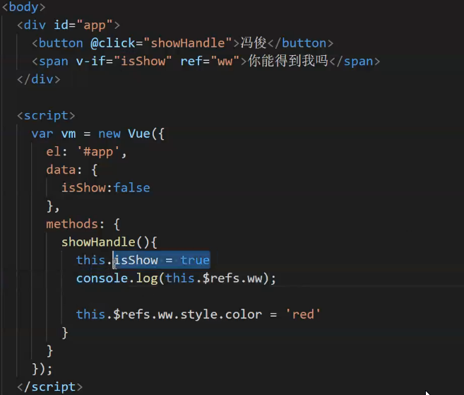

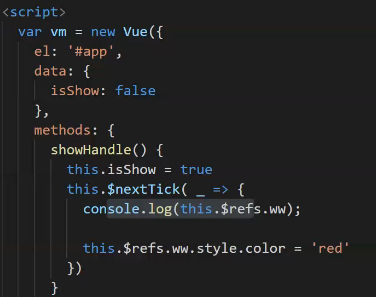

### 箭头函数

```html
<!DOCTYPE html>
<html lang="en">
<head>
    <meta charset="UTF-8">
    <meta name="viewport" content="width=device-width, initial-scale=1.0">
    <title>Document</title>
</head>
<body>
    <script>
        let obj = {};
        obj.name = "obj";
        obj.f = function(){
            console.log(this); // 指向调用者 obj.f();
            function fn1() {
                console.log(this)
            }
            fn1(); // Window.fn1()  this指向Window
            let fn2 = ()=> {
                console.log(this); // 箭头函数的this 与声明的作用域有关
            }
            fn2();
        }
        obj.f();
        obj.fn3 = ()=>{
            console.log(this);  // 此时this指向Window
        }
        obj.fn3();
    </script>
</body>
</html>
```

### 指定条件遍历数组的方法整理

```html
<!DOCTYPE html>
<html lang="en">

<head>
    <meta charset="UTF-8">
    <meta name="viewport" content="width=device-width, initial-scale=1.0">
    <title>Document</title>
</head>

<body>
    <script>
        // forEach: 遍历每个数组元素，没有返回值
        // filter: 将满足过滤条件的元素，保存到新数组中 返回值为此新数组
        //some：查看数组中是否有符合条件的元素，回调函数中return true时，终止循环，返回一个bool值 有true 无 false 可用于判断用户名是否存在，数据是否重复
        //find：查找第一个符合条件的数组元素，回调函数中return true时，终止循环，返回值为数组元素 -- 查找符合条件的数组元素
        //findIndex：查找符合条件的数组元素索引，回调函数中return true时，终止循环，返回值为索引 -- 查找数组元素的索引

        // forEach
        let arr = ["a0", "b1", "c2", "d3", "e4"]
        let res = arr.forEach((item, index, array) => {
            console.log("--------");
            console.log(item);
            console.log(index);
            console.log(array);
        })
        console.log(res); // undefined

        let salary = [200, 100, 150, 230, 350, 59];
        // filter
        let res2 = salary.filter((item, index) => {
            return item > 100;
        })
        console.log(res2); // [200, 150, 230, 350]

        let i = 0; //记录循环次数
        let j = 0;
        let k = 0;
        // some
        let res3 = salary.some(item => {
            i++;
            return item >= 100;
        });
        console.log(i); // 1
        console.log(res3); // true  有符合条件的元素存在 第1个

        let res4 = salary.find(item => {
            j++;
            return item >= 100;
        });
        console.log(j); // 1
        console.log(res4); // 对应的满足条件的元素值

        let res5 = salary.findIndex(item => {
            k++;
            return item >= 100;
        });
        console.log(k); // 1
        console.log(res5); // 0  对应的索引
    </script>
</body>

</html>
```


### 组件化开发

#### 组件化的开发思想

1. 统一的标准
2. 分而治之  不同组件分别实现不同功能
3. 重用（复用）
4. 组合  组件之间通过组合 可以形成相对成熟的项目


组件化规范：Web Components

- 我们希望尽可能多的重用代码
- 自定义组件的方式不太容易（html\css\js）
- 多次使用组件可能导致冲突


官网：

组件：是一个vue实例容器，包含了重用的html\css\js

#### 组件注册

```html
<!DOCTYPE html>
<html lang="en">
<head>
    <meta charset="UTF-8">
    <meta name="viewport" content="width=device-width, initial-scale=1.0">
    <title>Document</title>
</head>
<body>
    <div id="app">
        <components></components>
    </div>
    <script src="../js/vue.js"></script>
    <script>
        Vue.component('components', {
            data() {
                return {
                    count: 0
                }
            },
            template: `
					<div>
						<button @click="handle">{{count}}</button>
        			</div>`,
            methods: {
                handle(){
                    this.count++;
                }
            },
        });
        var vm = new Vue({
            el: '#app'
        })
    </script>
</body>
</html>
```

#### 组件命名方法

1. 组件的命名方式 短横线方式 大驼峰方式
2. 短横线的方式可以应用于根组件和其他组件的模板中
3. 大驼峰命名法 应用在根组件模板中 会被当成element解析成 全小写的，
4. 因为html的解析标签不区分大小写，但是js是区分大小写的，所以找不到对应的定义
5. 但是可以应用在其他组件的模板中

```html
<!DOCTYPE html>
<html lang="en">

<head>
    <meta charset="UTF-8">
    <meta name="viewport" content="width=device-width, initial-scale=1.0">
    <title>Document</title>
</head>

<body>
    <div id="app">
        <component-add></component-add>

    </div>
    <script src="../js/vue.js"></script>
    <script>
        /**
            组件的命名方式 短横线方式 大驼峰方式
            短横线的方式可以应用于根组件和其他组件的模板中
            大驼峰命名法 应用在根组件模板中 会被当成element解析成 全小写的，
            因为html的解析标签不区分大小写，但是js是区分大小写的，所以找不到对应的定义
            但是可以应用在其他组件的模板中
        */
		// 全局组件
        Vue.component('component-add', {
            data() {
                return {
                    count: 0
                }
            },
            // 组件模板中只能包含一个根元素
            template: `
                <div>
                    <button @click="handle">{{count}}</button>
                    <ComponentAdd></ComponentAdd>
                </div>`,
            methods: {
                handle() {
                    this.count++;
                }
            },
        });
        Vue.component('ComponentAdd', {
            // data 为function 返回值为一个对象 此对象为data的值
            data() {
                return {
                    count: 0
                }
            },
            // 组件模板中只能包含一个根元素
            template: `
        <div>
            <button @click="handle">{{count}}</button>
        </div>`,
            methods: {
                handle() {
                    this.count++;
                }
            },
        });
        // 所有的子组件都包含在根组件内 Vue实例对象即为根组件 data可以为对象
        var vm = new Vue({
            el: '#app',
            data: {

            }
        })
    </script>
</body>

</html>
```


#### Vue调试工具的用法

chrome插件 方便查看组件之间的关系 及其数据展示

#### 组件间的数据交互 （重点）

##### 在父组件模板中 向子组件传值

```
在父组件模板中 为子组件添加属性（:属性名="数据"） 绑定传送的数据
在子组件中 通过 props属性接收。可以设置为数组或者对象，推荐使用对象的方式，因为可以过滤数据的类型。
```

##### 子组件控制父组件行为及传递参数

```
子组件触发：因为是dom,bom元素才能触发事件 而子组件上的元素又在  template 上，template上的元素 又可以通过v-on 的方式绑定了事件触发函数   事件触发函数可以调用当前子组件的data  同时可以通过this.$emit('父组件的Vue模板中子组件的实现元素上的v-on的事件名',需要传递的参数) 触发父组件的相应的绑定事件，并且可以传递参数，同步参数到父组件的事件触发函数中，从而在父组件中的handle(val){}中处理子组件传递过来的参数，同步更新或修改到父组件的data中。
```

##### 兄弟组件之间的传值

```
创建数据中心： var eventHub = new Vue();
数据中心负责监听、销毁、触发
创建两个全局组件，设置为兄弟关系
全局挂载：main.js上 原型挂载 Vue.prototype.bus = new Vue()
为这两个兄弟组件的template上的元素绑定触发事件
在绑定的事件函数中 调用数据处理中心的触发函数  enventHub.$emit('需要触发的已被数据处理中心监听的事件名称',传递的参数)
同时在生命周期钩子函数mounted()中，指定当前组件需要被数据中心监听的事件名称和处理函数
mounted(){
	enventHub.$on('事件名称',(接收传递过来的数据的形参)=>{
		处理（如通过传递过来的数据修改当前组件的data）
	})
}

通过enventHub.$on()监听的组件事件，就可以在当前组件或者其他兄弟组件中通过 enventHub.$emit("需调用的数据处理名"，参数)进行调用，从而操作组件自身 或者兄弟组件

enventHub.off("绑定的数据处理事件1","绑定的数据处理事件2"...);可以销毁相应的时间处理事件
```

```html
<!DOCTYPE html>
<html lang="en">

<head>
    <meta charset="UTF-8">
    <meta name="viewport" content="width=device-width, initial-scale=1.0">
    <title>Document1</title>
</head>

<body>
    <div id="app">
        <!-- :content 动态绑定父组件中的值 title 静态绑定父组件中的值
             title是处于父组件的template中，所以也属于父组件中的值 -->
        <component-add :my-content="msg+'父组件绑定的值'"  my-title="父组件绑定的值" :arr-data="arrData"></component-add>
        <p :style="{fontSize:fontSize + 'px'}">效果展示</p>
        <hello-a></hello-a>
        <component-b @fa-click="handleFa($event)" :arr-data="arrData"></component-b>
    </div>
    <script src="../js/vue.js"></script>
    <script>
        // 创建数据事件中心
        var eventHub = new Vue();


        /**
            组件的命名方式 短横线方式 大驼峰方式
            短横线的方式可以应用于根组件和其他组件的模板中
            大驼峰命名法 应用在根组件模板中 会被当成element解析成 全小写的，
            因为html的解析标签不区分大小写，但是js是区分大小写的，所以找不到对应的定义
            但是可以应用在其他组件的模板中
        */

        Vue.component('component-add', {
            // 组件中传递数据的值的命名规范 遵循驼峰命名规范 字符串模板中引用也是如此，
            // Vue实例模板中用"-"连接 改为全小写
            // props 单项数据流传递
            // props: ['myTitle','myContent'],
            props: {
                myTitle: String,
                myContent: String,
                arrData: Array,
            },
            data() {
                return {
                    count: 0,
                    addNum: 2,
                }
            },
            // 组件模板中只能包含一个根元素
            template: `
                <div>
                    <button @click="handle">兄-兄A{{count}}{{myTitle}}{{myContent}}</button>
                    <ul>
                        <li :key="index" v-for="(item,index) in arrData">{{item}}</li>    
                    </ul>
                    <ComponentAdd></ComponentAdd>
                </div>`,
            methods: {
                handle() {
                    this.count++;
                    eventHub.$emit('event-b',this.addNum);
                }
            },
            mounted() {
                eventHub.$on('event-a',(val)=>{
                    this.count+=val;
                })
            },
        });
        // 此组件作为component-add组件的子组件
        Vue.component('ComponentAdd', {
            data() {
                return {
                    count: 0
                }
            },
            // 组件模板中只能包含一个根元素
            template: `
                <div>
                    <button @click="handle">{{count}}</button>
                </div>`,
            methods: {
                handle() {
                    this.count++;
                }
            },
        });

        var ComponentB = {
            data() {
                return {
                    count: 0,
                    addFontSize: 3,
                    addNum: 1,
                }
            },
            props: {
                arrData: Array
            },
            // 组件模板中只能包含一个根元素
            template: `
                <div>
                    <button @click="handle">兄-兄B{{count}}{{arrData}}</button>
                    <ComponentAdd></ComponentAdd>
                </div>`,
            methods: {
                handle() {
                    // this.count++;
                    this.arrData.push(this.count)
                    this.$emit("fa-click",{addFontSize:this.addFontSize,arrDataChange:this.arrData});
                    eventHub.$emit('event-a',this.addNum)
                }
            },
            mounted:function(){
                eventHub.$on('event-b',(val)=>{
                    this.count+=val;
                })
            }
        };
        // 所有的子组件都包含在根组件内 Vue实例对象即为根组件 data可以为对象
        var vm = new Vue({
            el: '#app',
            data: {
                msg: "Vue Data",
                arrData: ["1","2","3"],
                objData: {
                    name: 'coder rat',
                    age: 25
                },
                fontSize: 20,
            },
            methods: {
                handleFa(value){
                    console.log(value)
                    this.fontSize += value.addFontSize;
                    this.arrData = value.arrDataChange;

                }
            },
            // 局部组件 只能在#app的页面模板中使用
            components: {
                'hello-a': {
                    data() {
                        return {
                            count: 0
                        }
                    },
                    // 组件模板中只能包含一个根元素
                    template: `
                                <div>
                                    <button @click="handle">{{count}}</button>
                                    <ComponentAdd></ComponentAdd>
                                </div>`,
                    methods: {
                        handle() {
                            this.count++;
                        }
                    },
                },
                'component-b': ComponentB
            }
        })
    </script>
</body>

</html>
```

---


##### 其他传值方式（获取相应组件，以赋值的形式进行同步）

```
this.$children.属性
this.$parent.属性
```

**父向子传值的其它方式**

```html
<!DOCTYPE html>
<html lang="zh-CN">

<head>
  <meta charset="UTF-8">
  <meta name="viewport" content="width=device-width, initial-scale=1.0">
  <meta http-equiv="X-UA-Compatible" content="ie=edge">
  <title>Document</title>
  <script src="js/vue.js"></script>
</head>

<body>
  <!-- 父向子传值的其它方式 -->
  <div id="app">
    <button @click="handle1">父向子传值 -- 方式1</button>
    <button @click="handle2">父向子传值 -- 方式2</button>
    <hr>
    <!-- ref 是vue中的标记属性，方便父组件快速获取元素或组件的 -->
    <com-son1 ref="comson1"></com-son1>
    <p ref="para"></p>
  </div>

  <script>
    Vue.component('com-son1', {
      template: `<div>
      <h3>com-son1组件</h3>
      <p>展示父组件数据：{{son}}</p>
    </div>`,
      data() {
        return {
          son: ''
        }
      }
    });

    var vm = new Vue({
      el: '#app',
      data: {
        fa: '我是霸霸'
      },
      methods: {
          //通过获取子组件，给子组件赋值的方式，将父组件的值设置到子组件中
        handle1(){
          console.log(this.$children);
          // this.$children 保存所有的子组件
          this.$children[0].son = this.fa;  //第一种父向子传值
        },
        handle2(){
          console.log(this.$refs);
          this.$refs.comson1.son = this.fa;  //第二种父向子传值
        }
      }
    });
  </script>
</body>

</html>
```

**子向父传值的其它方式**

```html
<!DOCTYPE html>
<html lang="zh-CN">

<head>
  <meta charset="UTF-8">
  <meta name="viewport" content="width=device-width, initial-scale=1.0">
  <meta http-equiv="X-UA-Compatible" content="ie=edge">
  <title>Document</title>
  <script src="js/vue.js"></script>
</head>

<body>
  <div id="app">
    <p>展示来自子组件的内容:{{fa}}</p>
    <hr>
    <com-son1></com-son1>
  </div>

  <script>
    Vue.component('com-son1', {
      data(){
        return {
          son:'儿砸'
        }
      },
      template: `<div>
        <h3>com-son1组件</h3>
        <button @click="handle">子向父</button>
      </div>`,
      methods:{
        handle(){
          this.$parent.fa = this.son;
        }
      }
    });

    var vm = new Vue({
      el: '#app',
      data: {
        fa:''
      },
      methods: {}
    });
  </script>
</body>

</html>
```

```
理解什么是父组件 什么是子组件

组件间的传值
父 → 子 传值
子 → 父 传值
兄弟 → 兄弟 传值

插槽
```

### 组件插槽

在调用组件的时候，将组件中包裹的内容展示到页面中

作用：同一个组件可以展示不同的内容

#### 1.组件插槽的基本用法（默认插槽）

```html
<!DOCTYPE html>
<html lang="en">
<head>
    <meta charset="UTF-8">
    <meta name="viewport" content="width=device-width, initial-scale=1.0">
    <title>Document</title>
    <script src="../js/vue.js"></script>
</head>
<body>
    <div id="app">
        <!-- 子组件传递的插槽内容,包裹在组件调用中间 -->
        <component-a>插槽内容</component-a>
        <component-a>插槽内容2</component-a>
        <component-a></component-a>
    </div>
    <script>
        Vue.component('component-a',{
            template: `<div>
                    <p>子组件1</p>
                    <!-- 插槽内有默认内容时，组件调用中没有内容时显示 -->
                    <slot>默认内容</slot>
                </div>`,
        })
        var vm = new Vue({
            el: '#app',
            data:{

            }
        })
    </script>
</body>
</html>
```

#### 2.具名插槽：通过name属性，区分不同的插槽

* 基本用法

  在组件中通过slot属性控制对应插槽的内容，

  ```html
  <div id="app">
      <!-- 子组件传递的插槽内容,包裹在组件调用中间 -->
      <component-a>
          <div slot="header">
              <p>header插槽内容1</p>
              <p>header插槽内容2</p>
              <p>header插槽内容3</p>
          </div>
          <p>默认插槽1</p>
          <p>默认插槽2</p>
          <p>默认插槽3</p>
          <template slot="footer">
              <p>footer插槽内容1</p>
              <p>footer插槽内容2</p>
              <p>footer插槽内容3</p>
          </template>
      </component-a>
  </div>
  <script>
      Vue.component('component-a',{
          template: `<div>
              <p>子组件1</p>
              <slot name="header"></slot>
              <slot></slot>
              <slot name="footer"></slot>
          </div>`,
      })
      var vm = new Vue({
          el: '#app',
          data:{
  
          }
      })
  </script>
  ```

  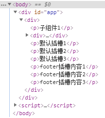

* 通过template插入内容：template标签只作为容器使用，不会渲染到页面

* 插槽内容的显示顺序：由插槽的顺序决定，与填充内容的顺序无关


如何在填充的数据中获取组件中的数据

作用域插槽

应用场景：父组件可以对子组件的内容进行加工处理

在父组件中可以得到子组件中的通过v-bind绑定的数据

```html
<!DOCTYPE html>
<html lang="en">
<head>
    <meta charset="UTF-8">
    <meta name="viewport" content="width=device-width, initial-scale=1.0">
    <title>Document</title>
    <script src="../js/vue.js"></script>
</head>
<body>
    <div id="app">
        <component-a>
            <template slot="footer" slot-scope="scopes">
                <p v-if="scopes.item == 'item-header'||scopes.item == '默认item'||scopes.item == 'item-footer'">I am {{scopes.item}}</p>
                <p v-else>I am not {{scopes.item}}</p>
            </template>
        </component-a>
    </div>
    <script>
        Vue.component('component-a',{
            template: `<div>
                    <p>子组件模板内容</p>
                    <slot name="header" :item="'item-header'"></slot>
                    <slot :item="'默认item'"></slot>
                    <slot name="footer" :item="'item-footer'"></slot>
                </div>`,
        })
        var vm = new Vue({
            el: '#app',
            data:{

            }
        })
    </script>
</body>
</html>
```

，从而通过对绑定数据进行一系列的处理，实现展示逻辑，又利用

```html

```

Restful形式的URL

* HTTP请求方式
  + GET  查询
  + POST  添加
  + PUT  更新 修改
  + DELETE 删除


Promise 用法

Promise是异步编程的一种解决方案，从语法上讲，Promise是一个对象，从它可以获取异步操作的消息。

使用Promise主要的好处：

1. 可以避免回调函数多次嵌套产生的回调地狱问题（将相互嵌套的方式转换成链式编程 的写法）
2. Promise对象提供了简洁的API，使得控制异步操作更加容易


ES6新语法：异步编程

#### 异步调用

异步效果分析

1. 定时任务
2. Ajax
3. 事件函数

多次异步调用的依赖分析

多次嵌套


**Promise对象实质上是一个函数，Promise原型上挂载了.then(callback(上个then返回的Promise对象/上个then返回的值))方法。**

Promise常用的API

1. 实例方法

   .then()  获取正常结果

   .catch() 获取异常结果

   .finally()  无论返回值正常与否都会执行

```js
function getData(url){
	return new Promise(function(resolve,reject){
		$.ajax({
			type: 'get',
			url: url,
			success(res){
				resolve(res);
			},
			error(err){
				reject(err)
			}
		})
	})
}
// then中的第一个函数：请求成功之后的回调
// then中的第二个函数：请求失败之后的函数
getData('http://localhost:3000/data')
.then((res)=>{
    console.log(res);
    return getData('http://localhost:3000/data1')
}).catch((res)=>{
    console.log(res)
}).finally((res)=>{
    console.log('处理完成！')
})
.then((res)=>{
    console.log(res);
    return "hello"
})
.then((res)=>{
    console.log(res);
})
```

Promise对象直接挂载的API 

```js
// 异步处理三个promise对象（函数），等待所有promise处理完成，一并返回
Promise.all([p1,p2,p3]).then(function(res){
	console.log(res)
})
// 异步处理三个promise对象（函数），返回最先完成的promise结果
Promise.race([p1,p2,p3]).then(function(res){
    console.log(res)
})
```


### fetch API基本用法

```
fetch('url').then((res)=>{ // res是一个response对象
	// res.text()只能调用一次
	return res.text();  // 返回文本数据
	return res.JSON();  // 返回JSON数据（对象）
}).then(res=>{
	console.log(res)
})
```

#### fetch请求参数

常用配置选项

```
fetch('url?id=123',{ 
	method: 'get'
}).then(res=>{
	return res.text()
}).then(res=>{
	console.log(res)
})
fetch('url/books/123',{  // 后台 '/books/:id'  Restful风格传参
	method: 'get'  // 'delete'
}).then(res=>{
	return res.text()
}).then(res=>{
	console.log(res)
})
// post -- string
fetch('url/books',{ 
	method: 'post',
	body: 'uname=lisi&pwd=123',
	headers: {
		'Content-Type': 'application/x-www-form-urlencoded'
	}
}).then(res=>{
	return res.text()
}).then(res=>{
	console.log(res)
})
// post -- JSON
fetch('url/books',{  // res.send(req.body.uname)
	method: 'post',
	body: JSON.stringify({
		uname:lisi,
		pwd: 1234
	}),
	headers: {
		'Content-Type': 'application/json'
	}
}).then(res=>{
	return res.text()
}).then(res=>{
	console.log(res)
})
```


### axios

axios是一个基于Promise用于浏览器和node.js的HTTP请求处理库

```html
<!DOCTYPE html>
<html lang="en">
<head>
    <meta charset="UTF-8">
    <meta name="viewport" content="width=device-width, initial-scale=1.0">
    <title>Document</title>
    <script src="./js/axios.js"></script>
</head>
<body>
    <script>
        axios.defaults.timeout=3000;// 超时时间
        axios.defaults.baseURL = "http://localhost:3000/"; //默认请求地址
        axios.defaults.headers['mytoken'] = 'asdasafadfaf2sadsaadsd';//设置请求头，会在请求头添加一个属性
        axios.get('http://localhost:3000/adata').then(ret=>{
            console.log(ret)
            console.log(ret.data)
        })
        axios.get('http://localhost:3000/axios?id=123').then(ret=>{
            console.log(ret)
            console.log(ret.data)
        })
        axios.get('http://localhost:3000/axios/123').then(ret=>{
            console.log(ret)
            console.log(ret.data)
        })
        axios.get('http://localhost:3000/axios',{
            params: {
                id: 987
            }
        }).then(ret=>{
            console.log(ret)
            console.log(ret.data)
        })
        axios.delete('http://localhost:3000/axios',{
            params: {
                id: 987
            }
        }).then(ret=>{
            console.log(ret)
            console.log(ret.data)
        })
        axios.post('http://localhost:3000/axios',{
            uname: "coder rat",
            pwd: 2522
        }).then(ret=>{
            console.log(ret)
            console.log(ret.data)
        })
        var params = new URLSearchParams();
        params.append('uname',"Coder Rat");
        params.append('pwd',123456);
        axios.post('http://localhost:3000/axios',params).then(ret=>{
            console.log(ret)
            console.log(ret.data)
        })
        axios.put('http://localhost:3000/axios/iddssa2311',{
            uname: "Rat Guo",
            pwd: 2522
        }).then(ret=>{
            console.log(ret)
            console.log(ret.data)
        })
        axios.put('axios/iddssa2311',{
            uname: "Rat Guo",
            pwd: 2522
        }).then(ret=>{
            console.log(ret)
            console.log(ret.data)
        })
    </script>
</body>
</html>
```


### 路由 Router

前端路由

概念：根据不同的用户事件，显示不同的页面内容

本质：用户事件与事件处理函数之间的对应关系


### Vue前端工程化（前端模块化）

模块化的相关规范

webpack

Vue单文件组件

Vue脚手架

Element-UI  Vue组件库


#### 模块化的概述

##### 传统开发模式的主要问题

1. 命名冲突（多个JS之间相同命名的变量覆盖问题）
2. 文件依赖关系不明确

##### 通过模块化解决上述问题

- **模块化**就是把单独的一个功能封装到一个模块（文件）中，模块之间相互隔离，但是可以通过特定的接口公开内部成员，也可以依赖别的模块。
- 模块化开发的好处：方便代码的重用，从而提高开发效率，并且方便后期维护。

##### 模块化相关规范

- 浏览器端模块化规范

  1. AMD   [require.js](https://requirejs.org/)

  2. CMD   [Sea.js](https://seajs.github.io/seajs/docs)

     Sea.js 遵循 [CMD](https://github.com/cmdjs/specification/blob/master/draft/module.md) 规范，可以像 [Node.js](http://nodejs.org/) 一般书写模块代码。

以上模块化规范如今已经落伍，有相应的替代方案。

##### 服务器端模块化规范

1. CommonJS
   - 模块分为 **单文件模块** 与 **包**
   - 模块成员导出：moudle.exports 和 exports（moudle.exports的引用）
   - 模块成员导入：require('模块标识符')

#####   大一统的模块化规范-ES6模块化

在ES6模块化规范诞生之前，JavaScript社区已经尝试并提出了AMD CMD CommonJS等模块化规范。

但是，这些社区提出的模块化标准，还是存在一定的**差异性**与**局限性**，**并不是**浏览器与服务器端**通用的模块化标准**

- AMD CMD 适用于浏览器的JavaScript模块化
- CommonJS 适用于服务器端的JavaScript模块化

因此，**ES6语法规范中**，在语言层面上定义了ES6模块化规范，是浏览器端与服务器端通用的模块化开发规范。

- 每一个JS文件都是一个独立的模块
- **导入模块成员**使用`import `关键字
- **暴露模块成员**使用`export`关键字

##### Node.js中通过`babel`体验ES6模块化

~~~shell
create a new folder for projects
```
npm init
npm install @babel/core @babel/node @babel/preset-env @babel/cli --save--dev
npm install @babel/polyfill --save
```
then,create a file named 'babel.config.js' at root
code in file
```
const presets = [
    ['@babel/env', {
        targets: {
            edge: '17',
            firefox: '60',
            chrome: '67',
            safari: '11.1'
        }
    }]
]

module.exports = { presets }
```
~~~

### ES6 模块化基本语法

#### 1. 默认导出 与 默认导入

- 默认导出语法 export default {默认导出的成员}
- 默认导入语法 import 接收名 from './m1.js'

在一个模块中 export default 最多只能使用一次

#### 2.按需导出 与 按需导入

- 按需导出语法：export let s1 = 'aaa'
- 按需导入语法：import { s1,s2 as ss2 } from './m1.js'

在每个模块中，可以使用多次按需导出

#### 3.直接导入并执行模块中的代码

有时候，我们**只想单纯执行某个模块中的代码，并不需要得到模块中向外暴露的成员**，此时，可以直接导入并执行模块代码。

```
import './m1.js'
```

### webpack

#### 当前web开发面临的困境

- 文件依赖关系错综复杂
- 静态资源请求效率低
- 模块化支持不友好
- 浏览器对高级JavaScript特性兼容程度较低
- etc...

#### webpack 介绍

webpack 是一个**流行的前端项目的构建工具（打包工具），可以解决当前web开发中所面临的的困境**。

本质上，*webpack* 是一个现代 JavaScript 应用程序的*静态模块打包器(module bundler)*。当 webpack 处理应用程序时，它会递归地构建一个*依赖关系图(dependency graph)*，其中包含应用程序需要的每个模块，然后将所有这些模块打包成一个或多个 *bundle*。

webpack提供了**友好的模块化支持**，以及**代码压缩混淆、处理js兼容问题、性能优化**等强大的功能，从而让程序员把工作的重心放到具体的功能实现上，提高了开发效率和项目的可维护性。

目前，绝大多数的企业中的前端项目，都是基于webpack进行打包构建的。

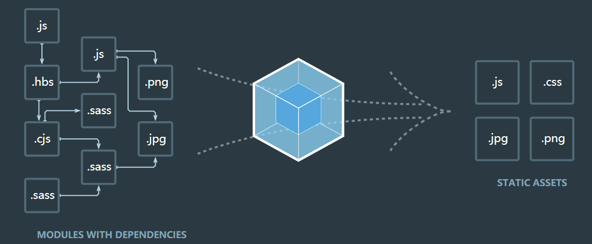


#### webpack 的基本使用

+ 创建列表隔行变色项目
  - 新建项目空目录（命名使用英文），并运行npm init -y命令，初始化包管理配置文件`package.json`
  - 新建 src 源代码目录（webpack打包的源目录）
  - 在 src 目录下，新建`index.html`文件（首页）
  - 初始化首页基本结构内容
  - 根目录打开终端，运行 `npm install jquery -S`命令，安装JQuery
  - 通过模块化的形式，在src下的`index.js`中实现隔行变色效果

- 在项目中安装和配置 webpack

  - 运行 `npm install webpack webpack-cli -D`(安装webpack命令行工具)

  - 在项目根目录中，创建名为 `webpack.config.js`的webpack配置文件

  - 在 webpack 的配置文件中，添加初始化配置代码

    ```js
    module.exports = {
        //mode用来指定构建模式
        // （通过开发模式，转化的代码不会压缩混淆）
        // 可选production(产品发布模式 == 上线)
        mode: 'development',
    }
    ```

  - 在 package.json 配置文件中的 script 节点下，新增 dev 脚本如下：

    ```json
    //script节点下的脚本,可以通过npm run执行
    "dev": "webpack" 
    ```

  - 在终端中运行 npm run dev 命令，启动 webpack 进行项目打包

    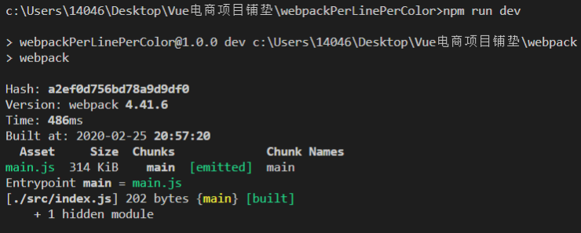

+ 配置 webpack 打包的入口和出口

  - webpack 的 4.x 版本中默认约定：

    + 打包的入口文件为 `src -> index.js`
    + 打包的出口文件为 `dist -> main.js`

  - 如果要修改打包的入口与出口，可以在 `webpack.config.js`中新增如下配置信息：

    ```js
    // 配置打包入口出口
    const path = require('path'); // 导入 node.js中专门操作路径的模块
    
    
    module.exports = {
        entry: path.join(__dirname,'./src/index.js'),// 打包的入口文件路径
        output: {
            path: path.join(__dirname,'./dist'), // 输出文件的存放路径‘
            filename: 'bundle.js', // 输出文件的名称
        }
    }
    ```

+ 配置 webpack 自动打包功能

  为了实时观测代码更新的页面展示效果

  - 运行 `npm install webpack-dev-server -D`命令，安装支持项目自动打包的工具

  - 修改`package.json ->scripts`脚本中的 dev 命令如下：

    ```json
    "dev": "webpack-dev-server"
    ```

  - 将`src -> index.html`中，script 脚本的引用路径，修改为"/bundle.js"（输出文件托管于8080/根目录，存储在内存中）

  - 运行 `npm run dev` 命令，重新进行打包

  - 在浏览器中直接访问 http://localhost:8080 ,查看自动打包效果

  > webpack-dev-server 会启动一个实时打包的 http 服务
  >
  > webpack-dev-server 打包生成的输出文件，默认放到了项目根目录中，而且是虚拟的，看不见的

- 配置 html-webpack-plugin 生成预览页面

  - 运行 `npm install html-webpack-plugin -D`命令，安装生成预览页面的插件

  - 修改 `webpack.config.js`文件的头部区域，添加如下配置信息：

    ```js
    const htmlWebpackPlugin = require('html-webpack-plugin');
    const htmlPlugin = new htmlWebpackPlugin({
        // 创建插件的实例对象
        template: './src/index.html',// 指定引用模板路径
        filename: 'index.html', // 指定生成文件的名称，生成的文件存在于内存中，目录中不显示
    }) 
    ```

  - 修改 `webpack.config.js` 文件中向外暴露的配置对象，新增如下配置节点：

    ```js
    module.exports = {
    	plugins: [htmlPlugin] //plugins 数组是 webpack 打包期间会用到的一些插件列表
    }
    ```

- 配置自动打包相关的参数

  ```
  package.json中的配置
  --open 打包完成后自动打开浏览器页面
  --host 配置 IP 地址
  --post 配置端口
  "scripts":{
  	"dev":"webpack-dev-server --open --host 127.0.0.1 --port 8888"
  }
  ```

  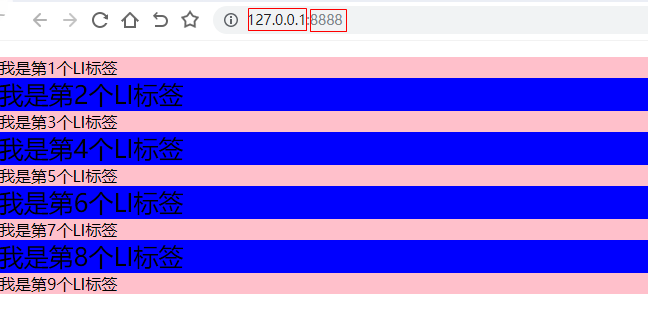

#### webpack 中的加载器 loader

**loader 用于对模块的源代码进行转换。loader 可以使你在 `import` 或"加载"模块时预处理文件。因此，loader 类似于其他构建工具中“任务(task)”，并提供了处理前端构建步骤的强大方法。loader 可以将文件从不同的语言（如 TypeScript）转换为 JavaScript，或将内联图像转换为 data URL。loader 甚至允许你直接在 JavaScript 模块中 `import` CSS文件！**

+ 通过 `loader`打包非js模块

  在实际开发过程中，webpack默认只能打包处理以 .js 后缀名结尾的模块，其他非 .js 后缀名称结尾的模块，webpack 默认处理不了，需要调用 **对应的loader 加载器才能正常打包，否则会报错！**

  loader 加载器可以协助 webpack 打包处理特定的模块文件，比如：

  - less-loader 可以打包处理 .less 相关的文件
  - sass-loader 可以打包处理 .scss 相关的文件
  - url-loader 可以打包处理 .css 中与 url 路径相关的文件

+ loader 的调用过程

  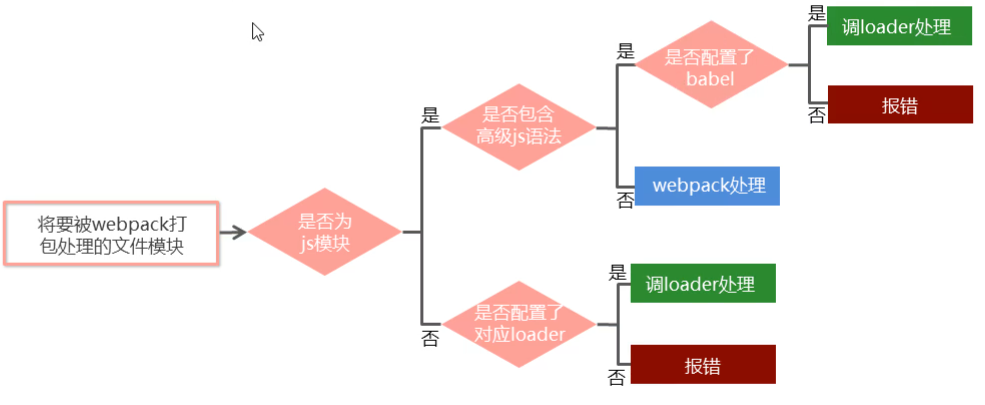

+ 打包处理 CSS 文件

  - 运行 npm i style-loader css-loader -D 命令，安装处理css文件的loader

  - 在 webpack.config.js 的 module -> rules 数组中，添加 loader 规则如下：

    ```js
    module: {
        rules: [
            // test表示要匹配的文件后缀（类型），use 表示要调用的loader
            // use 数组中指定的 loader 顺序是固定的，多个loader的调用顺序 是从后往前调用的
            {test:/\.css$/,use:['style-loader','css-loader']},
        ],
    }
    ```

    其中， test 表示匹配的文件类型， use 表示对应要调用的 loader。use 数组中指定的 loader 顺序是固定的，多个loader的调用顺序 是从后往前调用的。

+ 打包处理`less`文件

  - 运行 `npm i less-loader less -D`命令

  - 在 `webpack.config.js` 的module -> rules 数组中，添加 loader 规则如下：

    ```js
    {test:/\.less$/,use:['style-loader','css-loader','less-loader']}
    ```

+ 打包处理`scss`文件

  - 运行 npm i sass-loader node-sass -D 命令，安装相应的包(执行可能会报错，如果报错可以分别执行以下命令)

    ```shell
    npm i sass-loader -D
    npm i node-sass --sass_binary_site=https://npm.taobao.org/mirrors/node-sass/ -D
    ```

  - 在 `webpack.config.js` 的module -> rules 数组中，添加 loader 规则如下：

    ```js
    {test:/\.scss$/,use:['style-loader','css-loader','sass-loader']}
    ```

+ 配置 postCSS 自动添加 css 的兼容前缀

  css样式表中的 ::placeholder 伪类选择器 在不同浏览器，有兼容性问题，需要加上兼容性前缀

  为了解决类似以上的css兼容性问题，导入postcss-loader解决相应问题

  - 运行 npm i postcss-loader autoprefixer -D

  - 在项目根目录中创建postcss 的配置文件 postcss.config.js，并初始化如下配置：

    ```js
    // 导入自动添加兼容前缀的插件
    const autoprefixer = require("autoprefixer");
    
    module.exports = {
        plugins: [ autoprefixer ], // 挂载插件
    }
    ```

+ 打包样式表中的图片和字体文件

  - 运行 `npm i url-loader file-loader -D`命令

  - 在 webpack.config.js 的 module -> rules 数组中，添加 loader 规则如下：

    ```js
    module: {
    	rules: [
            {test:/\.jpg|jpeg|png|gif|bmp|ttf|eot|svg|woff|woff2$/,use:'url-loader?limit=169000'},
    	]
    }
    ```

    limit参数，是用于指定图片大小小于限定值169kb，就转化为加载速度更快的base64位的资源，图片真实大小大于等于169kb就不会转化，指向默认资源。

+ 打包处理js文件中的高级语法

  - 安装 babel 转换器相关的包：

    ```shell
    npm i babel-loader @babel/core @babel/runtime -D
    ```

  - 安装babel 语法插件相关的包：

    ```shell
    npm install @babel/preset-env @babel/plugin-transform-runtime @babel/plugin-proposal-class-properties -D
    ```

  - 在根目录中，创建 babel 配置文件 babel.config.js 并初始化基本配置如下：

    ```js
    // 配置babel的依赖插件
    module.exports = {
        presets: ['@babel/preset-env'],
        plugins: ['@babel/plugin-transform-runtime','@babel/plugin-proposal-class-properties'],
    }
    ```

  - 在根目录 webpack.config.js 中 module -> rules 下添加以下配置代码：

    ```js
    {test:/\.js$/,use:'babel-loader',exclude:/node_modules/},// exclude是排除项 排除node_modules中的所有js文件
    ```

### Vue 单文件组件

#### 传统组件的问题和解决方案

##### 问题：

1. 全局定义的组件必须保证组件的名称不重复
2. 字符串模板缺乏语法高亮和格式化，在节点过多的时候，需要用到丑陋的 \ 
3. 不支持 CSS ，意味着当 HTML 和 JavaScript 组件化时，CSS 明显被遗漏
4. 没有构建步骤限制，只能使用HTML 和 ES5 JavaScript，而不能使用预处理器（如：Babel）

##### 解决方案

针对传统组件的问题，Vue 提供了一个解决方案 ——使用Vue单文件组件。

#### Vue 单文件组件的基本用法

##### 单文件组件的组成结构（.vue）

- template  组件的模块区域
- script        业务逻辑区域
- style          样式区域

```html
<template>
	<!--这里用于定义Vue单文件组件的模板内容-->
</template>

<script>
	// 这里用于定义Vue组件的业务逻辑
    export default {
    	data(){ // 私有数据
            return {
                data1: dataValue1,
            }
        },
        methods:{
            eventFunction1(){
                
            },
            eventFunction2:function(){
                
            }
        },
        // ...其他业务逻辑
    }
</script>

<style scoped>
	/*这里定义了组件的样式*/
</style>
```

##### webpack 中配置 vue 组件的加载器

1. 运行 `npm i vue-loader vue-template-compiler -D`命令 下载loader和相关插件

2. 在 webpack.config.js 配置文件中，添加 vue-loader 的配置项 如下：

   ```js
   // 新建vue-loader plugin（插件）实例
   const VueLoaderPlugin = require('vue-loader/lib/plugin')
   const vuePlugin = new VueLoaderPlugin();
   
   plugins: [vuePlugin]
   rules: [ { test: /\.vue$/,use:'vue-loader' }]
   ```

   此时要保证vue组件中的style 不要加lang=""

##### 在 webpack 项目中使用 vue

1. 运行 `npm i vue -S` 安装 vue(vue.js)
2. 在 src -> index.js 入口文件中，通过 import Vue from 'vue' 来导入 vue 构造函数
3. 创建 vue 的实例对象，并指定要控制的 el 区域
4. 通过 render 函数渲染 App根组件 写法一定要注意，是`return`

```js
import Vue from 'vue'
// 导入单文件组件 App根组件
import App from './components/App.vue'

const vm = new Vue({
    el: '#app',
    render: h => {
        return h(App)
    } // render:h=>h(App)
})
```

##### webpack 打包发布

在package.json文件中的script脚本中添加

```json
"build":"webpack -p"
```

然后终端执行

```shell
npm run build
```

即可完成简单的webpack打包发布


### webpack 脚手架 

#### Vue脚手架的基本用法

Vue 脚手架用于快速生成Vue 项目基本架构，其官网地址为：https://cli.vuejs.org/zh/

1. ##### 通过交互式命令行方式，创建vue项目

```shell
npm i @vue/cli -g

vue -V  查看版本

vue create vue_proj_01  利用vue脚手架新建vue项目
相关选择配置项
Vue CLI v4.2.2
选择手动选择创建规则
? Please pick a preset: Manually select features
选择项目需要的插件
? Check the features needed for your project: Babel, Router
选择路由的模式 是历史模式还是hash模式
? Use history mode for router? (Requires proper server setup for index fallback in production) No
选择babel配置文件是单独创建还是在package.json中
? Where do you prefer placing config for Babel, ESLint, etc.? In dedicated config files
是否将此次设置保存为预设 为未来项目使用
? Save this as a preset for future projects? No
```

2. ##### 通过可视化vue-ui图形界面构建vue项目

   ```shell
   vue ui
   ```

3. ##### 交互式命令行，构建基于vue-cli2.x历史版本的vue项目

```shell
npm i @vue/cli-init
---
vue init webpack my-project
```


#### Vue-cli 构建项目的目录结构

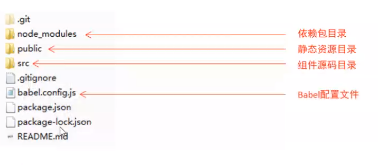

#### Vue 脚手架的自定义配置

##### 1.通过 package.json 配置项目

```json
// 必须是符合规范的json语法
// 在可视化工具对应
"vue": {
	"devServer":{
		"port":"8888", //端口号配置
		"open": true  // 编译完成在浏览器自动打开
	}
}
```

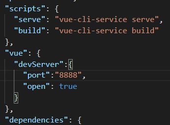

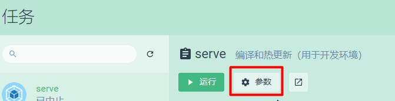

修改后，在当前项目根目录，打开终端

```shell
npm run serve
```

浏览器会自动打开以下界面，端口号为8888

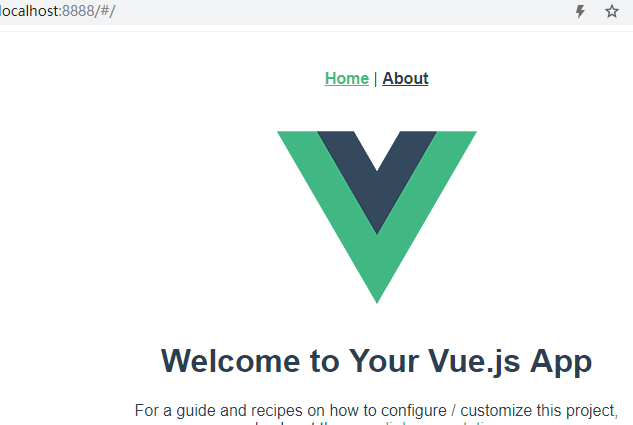

但是，并不推荐使用这种配置方式。因为 package.json 主要是用来管理包的配置信息，为了便于维护，推荐将 vue 脚手架相关的配置，单独定义到 vue.config.js 配置文件中。

#### 通过单独的配置文件配置项目

1. 在项目的根目录 创建文件 vue.config.js 配置文件
2. 在该文件中进行相关的配置，从而覆盖默认配置

```js
// vue.config.js
module.exports = {
    devServer: {
        port: 8888,
        open: true
    }
}
```

此配置和package.json中的上述配置不能重复，以上代码和package.json中配置效果相同。


---

### Element-UI 的基本使用

Element-UI：一套为开发者、设计师和产品经理准备的基于 Vue 2.0 的**桌面组件库。**

Element-UI中文 [官网](https://element-cn.eleme.io/#/zh-CN)

##### 1. 基于命令行方式手动安装

1. 安装依赖包 `npm i element-ui -S`
2. 导入 Element-UI 相关资源

```js
// src -> index.js
// 导入组件库 （js）
import ElementUI from 'element-ui';
// 配置组件相关样式 （CSS）
import 'element-ui/lib/theme-chalk/index.css'
// 配置 Vue 插件 将ElementUI安装到Vue上，这样Vue中每个组件都能够使用ElementUI中的那些组件了
Vue.use(ElementUI)
```

3. Vue根组件 App.vue 中添加Element-UI官网提供的样例代码

   ```html
   <div id="app">
       <el-row>
         <el-button>默认按钮</el-button>
         <el-button type="primary">主要按钮</el-button>
         <el-button type="success">成功按钮</el-button>
         <el-button type="info">信息按钮</el-button>
         <el-button type="warning">警告按钮</el-button>
         <el-button type="danger">危险按钮</el-button>
       </el-row>
   </div>
   ```

   效果如下：

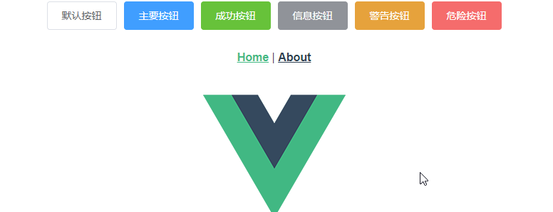

#### 2. 基于图形化Vue-cli UI 自动安装

1. 运行 vue ui 命令，打开图形化界面
2. 通过 Vue 项目管理器，进入具体的项目配置面板
3. 点击 插件 -> 添加插件，进入插件查询面板
4. 搜索 vue/cli-plugin-element 并安装 (作者ElementUI)
5. 配置插件，实现按需导入，从而减少打包后项目的体积

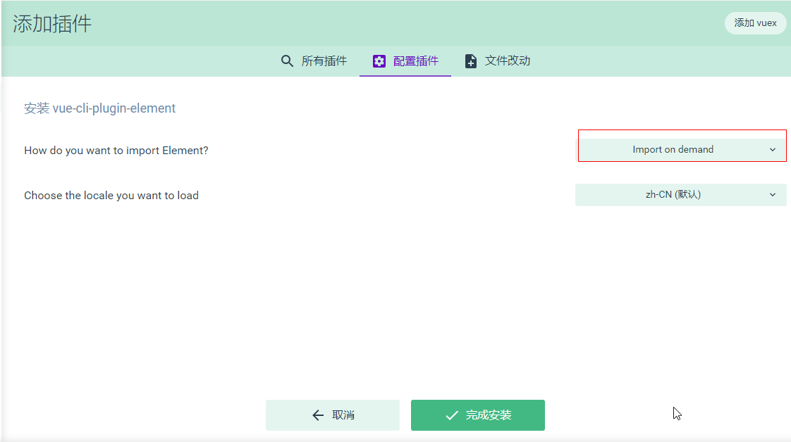

```js
// mian.js 入口路由
// 完成以上安装流程后，vue脚手架就自动给我们添加了以下代码
import './plugins/element.js'
// ------------
//element.js
import Vue from 'vue'
import { Button } from 'element-ui'

Vue.use(Button)
// 以上代码完成了按需导入了’element-ui‘的Button组件，并注册为Vue的插件

```

> 图形化界面在配置 element-ui时，有时候会将样式丢失
>
> 解决方案：
>
> 1.在依赖中卸载 element-ui，重新配置一次
>
> 2.手动导入样式：找到 plugins 文件夹中的element.js文件，添加 import 'element-ui/lib/theme-chalk/index.css'

---

**<u>以上为Vue项目开发的基础铺垫，接下来，就可以happy地结合以上准备，大干一场啦！</u>**

---

### Vue 电商全系统项目实战 Day 1

#### 项目结构


#### 电商后台管理系统的开发模式（前后端分离）

电商后台管理系统整体采用**前后端分离的开发模式**，其中前端项目是**基于Vue技术栈的SPA项目。**

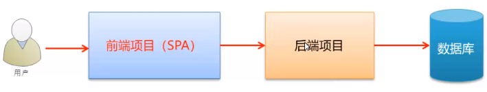

#### 电商后台管理系统的技术选型

前端项目技术栈

- Vue
- Vue-router
- Element-UI
- Axios          发送网络数据请求
- Echarts

后端项目技术栈

- Node.js
- Express
- Jwt              状态保持工具，类似于session的作用      
- Mysql
- Sequelize   操作数据库的框架


#### 前端项目初始化步骤

1. 安装 vue 脚手架
2. 通过 Vue 脚手架创建项目
3. 配置 Vue 路由
4. 配置 Element-UI 组件库
5. 配置 axios 库
6. 初始化 git 远程仓库
7. 将本地项目托管到 GitHub 或 码云 中


#### 码云配置

码云提供了基于SSH协议的Git服务，在使用SSH协议访问仓库仓库之前，需要先配置好账户/仓库的SSH公钥

设置->安全设置->SSH公钥

根据提示生成和设置公钥

生成公钥

在gitbash中输入

```shell
ssh-keygen -t rsa -C "码云注册邮箱"
```

按照提示完后三次回车，即可生成SSH公钥，并提示生成目录

id_rsa.pub文件 使用vscode打开，复制全部的内容，配置到SSH公钥中，保存，并输入密码确认

#### Git配置多个SSH-Key

[SSH Key](https://gitee.com/help/labels/19)

##### 背景

当有多个git账号时，比如：

a. 一个gitee，用于公司内部的工作开发；
b. 一个github，用于自己进行一些开发活动；

##### 解决方法

1. 生成一个公司用的SSH-Key

```
$ ssh-keygen -t rsa -C 'xxxxx@company.com' -f ~/.ssh/gitee_id_rsa
```

1. 生成一个github用的SSH-Key

```
$ ssh-keygen -t rsa -C 'xxxxx@qq.com' -f ~/.ssh/github_id_rsa
```

1. 在 ~/.ssh 目录下新建一个config文件，添加如下内容（其中Host和HostName填写git服务器的域名，IdentityFile指定私钥的路径）此处的config文件不要有任何后缀

```
# gitee
Host gitee.com
HostName gitee.com
PreferredAuthentications publickey
IdentityFile ~/.ssh/gitee_id_rsa
# github
Host github.com
HostName github.com
PreferredAuthentications publickey
IdentityFile ~/.ssh/github_id_rsa
```

4.用ssh命令分别测试

```
$ ssh -T git@gitee.com
$ ssh -T git@github.com
```

```shell
Hi CoderOfRat! You've successfully authenticated, but GITEE.COM does not provide shell access.
```

看到以上提示，代表基于SSH协议的Git服务已经连接成功。

然后就可以在码云新建一个与项目同名的仓库

#### 将本地项目托管到码云中

先做一下全局配置

```shell
按照码云提示初始化配置 
git config --global user.name "yourgitee username"
git config --global user.email "gitee email"
```

在本地项目根目录执行

```shell
git status 查看git本地仓库状态
如有更改或新增的文件，则执行
git add . 将所有改动添加到暂存区
git commit -m "提交备注信息" 本地提交 提交到本地仓库

git remote add origin https://gitee.com/coderofrat/vue_shop.git 设置提交源origin == https://gitee.com/coderofrat/vue_shop.git
git push -u origin master 推送本地代码到提交源 因为源仓库上没有master主分支，所以 -u 创建分支 master 并将此次推送提交到master主分支 在云端进行托管
```

#### 安装mysql数据库，

开发环节推荐 phpstudy 更轻 更方便

启动phpstudy中的mysql服务，然后在MySql管理器->MySql导入导出中选择后台提供的数据库文件进行恢复

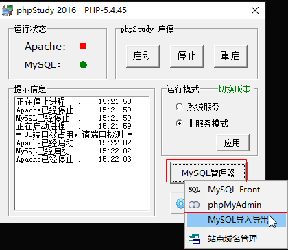

还原到数据库的名字和选择的文件同名`mydb`

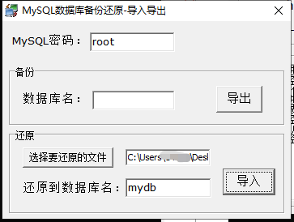

导入成功后，在后台根目录，npm i 下载依赖包，然后node app.js 运行服务。

服务开启后，在PostMan中进行接口调用测试，按照文档，测试登录验证接口是否可以正常调用。

一切正常后，就可以开始项目开发啦~


#### 登录/退出功能实现

##### 登录业务流程

1. 在登陆页面输入用户名和密码
2. 调用后台接口进行验证合法性
3. 通过验证之后，根据后台的响应状态跳转到项目主页（根组件）

##### 登录业务的相关技术点

1. http 是无状态的  所以需要下面几种形式记录状态
2. 通过 cookie 在客户端记录状态  容器
3. 通过 session 在服务器端记录状态  容器
4. 通过 token 方式维持状态  令牌 字符串 内容本身

如果前端与服务器之间不存在跨域问题，推荐使用cookie&session 记录保持用户的登录状态

如果前端与服务器之间存在跨域问题，推荐使用 token 方式维持登录状态

因为此次vue项目运行在新的端口号上，与服务器之间可能存在跨域问题，所以此时使用 token 方式。

#### 登录 - token 原理分析

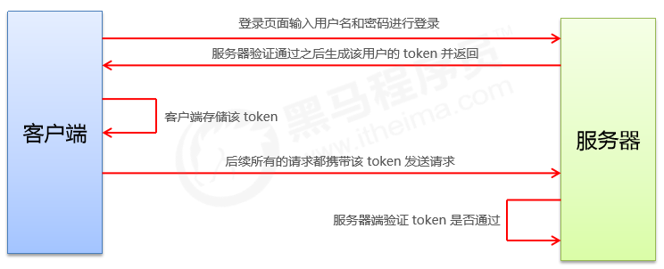

登陆成功时，由服务器生成对应用户的token值，每个用户的token值是不同的。

客户端储存该 token，后续所有的请求都携带该 token 发送请求（设置到请求头中）

服务器接收到请求，首先验证token的合法性，如果合法，才允许请求。针对携带的 token，响应相应请求，调用服务器接口返回数据。

#### 登录功能实现

##### 登录页面布局

通过 Element-UI 组件实现布局

需要组件：

el-form

el-form-item

el-input

el-button

阿里icon字体图标

---

首先创建子分支 login 在子分支上进行登录功能的开发

```shell
git status  查看当前分支的目录状态
如果干净，没有更新，执行
git checkout -b login  创建子分支login 并切换到 login分支
git branch  查看所有分支，当前所在分支为绿色带星
```

1. 删除根组件App.vue中的div#app节点内的所有内容
2. 清空导入的组件，删除挂载的默认组件
3. 清空样式内的所有内容
4. 删除路由入口文件main.js中不需要的组件导入，同时清空views文件夹
5. 修改router文件夹下的index.js，清空路由规则，删除默认的组件导入

保持页面初始化状态。

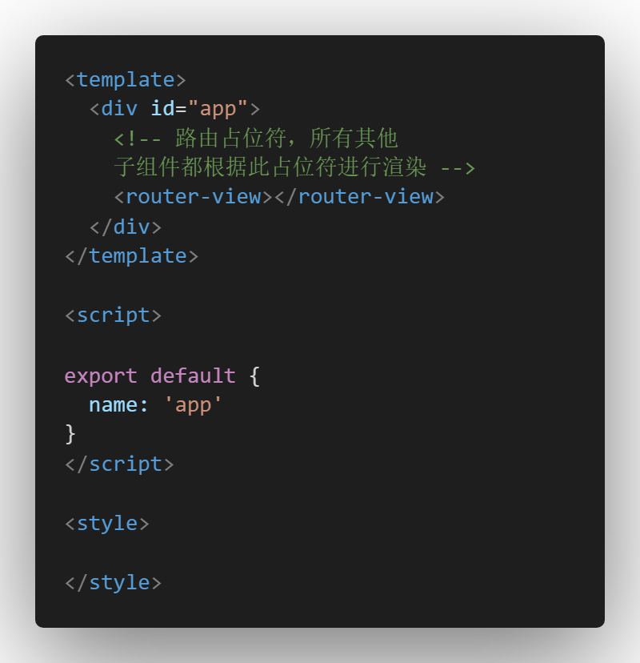

在components文件夹中新建 Login.vue 登录功能组件，并初始化组件内容，然后在根组件的模板中添加 router-view占位符，供子组件渲染

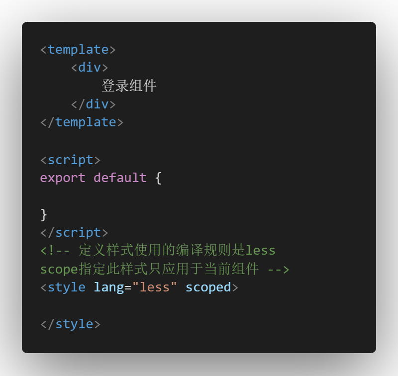

在router文件夹下的index.js中初始化以下代码

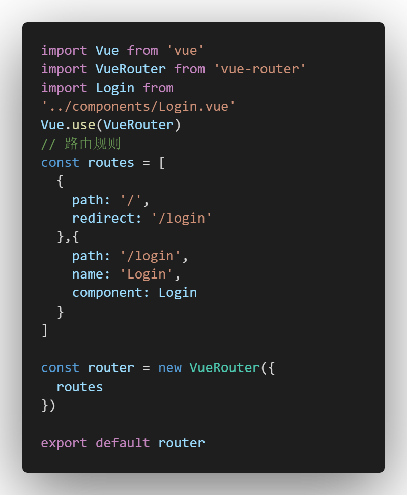

实现了访问http://localhost:8080 重定向到登录页面（组件）

下面开始实现页面布局

1. 下载less解析器

   `npm i less less-loader -D`

2. 添加全局样式文件

   在 `src -> assets -> css -> global.css`

3. 在 main.js 中导入全局样式

4. 在 Login.vue 中添加组件样式与结构

##### 绘制登录表单结构

1. 找到 element-ui组件库中的form模块，里面只复制文本框组件

2. 在plugins -> element.js 中按需导入和挂载组件

3. 找到 element-ui 组件苦衷，button 模块

4. 添加类名

   el-form 添加 class="login_form"

   el-form-item 添加class="btns"

5. 设置文本框组件的图标

   - 找到element-ui组件库中，input模块中 带图标的输入框
   - 将 prefix-icon 属性添加到 Login.vue 组件的 el-input身上 prefix-icon="图标引用"
   - 在assets文件夹中添加 fonts 阿里图标文件夹
   - 在main主入口文件导入需要的阿里图标样式文件
   - 复制对应的图标名到 prefix-icon=""中

```html
<!-- Login.vue template.login_container.login_box -->
<el-form ref="form">
    <!-- 用户名输入框 -->
    <el-form-item>
        <el-input prefix-icon="iconfont icon-user"></el-input>
    </el-form-item>
    <!-- 密码输入框 -->
    <el-form-item>
        <el-input prefix-icon="iconfont icon-3702mima"></el-input>
    </el-form-item>
    <!-- 按钮 登录 重置 -->
    <el-form-item class="btns">
        <el-button type="primary">登录</el-button>
        <el-button type="info">重置</el-button>
                </el-form-item>
```

```js
// main.js
// 导入阿里图标
import './assets/fonts/iconfont.css'
```

##### 绑定Login.vue的表单数据

1. 在data(){}中定义一个loginForm登录表单数据对象
2. 在 el-form 绑定 model属性 :model="loginForm"
3. 在 el-input 上双向数据绑定表单数据 v-model="loginForm.对应属性"

```html
<!-- Login.vue -->
<el-form ref="form" :model="loginForm">
    <!-- 用户名 -->
    <el-form-item>
        <el-input prefix-icon="iconfont icon-user" v-model="loginForm.username"></el-input>
    </el-form-item>
    <!-- 密码 -->
    <el-form-item>
        <el-input prefix-icon="iconfont icon-3702mima" v-model="loginForm.password" type="password"></el-input>
    </el-form-item>
    <!-- 按钮 登录 重置 -->
    <el-form-item class="btns">
        <el-button type="primary">登录</el-button>
        <el-button type="info">重置</el-button>
    </el-form-item>
</el-form>

<script>
export default {
    data(){
        return {
            // 这是登录表单的数据绑定对象
            loginForm:{
                username: '',
                password: ''
            }
        }
    }
}
</script>
```

##### 绑定Login.vue表单输入合法验证规则

1. 在Login.vue data中创建loginFormRules
2. 为 el-form 添加 :rules="loginFormRules" 绑定规则对象
3. 在 el-form-item 通过prop="属性"进行规则指定

##### 重置表单

1. 在el-form上绑定标记 ref="loginFormRef" 方便获取这个表单对象

2. 给重置按钮注册 @click="resetLoginForm" 事件

3. 在resetLoginForm处理程序中 调用 el-form 表单的 resetFields 方法重置表单

```js
this.$refs.loginFormRef.resetFields();
```

##### 发送请求前的数据校验

当表单符合验证规则，才允许发送登录请求

1. 给登录按钮注册 @click="login" 事件

2. 添加登陆事件处理函数

   this.$refs.loginFormRef.validate(valid =>{

   ​      console.log(valid)

    })

   如果校验通过，valid值为true,不通过，则返回值为false

##### 点击登录，发送请求

在main.js中导入axios，并设置axios请求公共根路径，将axios对象挂载在Vue构造函数的原型对象上

当表单前端验证通过后，发送请求，根据请求结果，调用element-ui的Message组件，返回不同的弹窗状态，然后进行接下来的处理

此处调用了element-ui的Message组件，由于Message组件属于行为组件，所以在element.js中通过 Vue.prototype.$message = Message的方法进行挂载，和样式组件不同，样式组件，直接使用Vue.use(组件)进行挂载

##### 登陆成功的处理

将登陆成功之后的token，保存到客户端的 sessionStorage 中

- 项目中除了登录之外的其他API接口，必须在登陆之后才能访问

- token 只应该在当前网站打开期间生效，所以将 token 保存到 sessionStorage 中
- window.sessionStorage.setItem("token",res.data.token)

通过编程式导航转跳到后台主页，路由地址为 /home

- this.$router.push("/home");

##### 路由导航守卫控制访问权限

如果用户没有登陆，但是直接通过URL访问特定页面，需要重新导航到登录页面。

```js
// router/index.js
// router.beforeEach 路由导航守卫（前置守卫，访问前的处理）
router.beforeEach((to,from,next)=>{
  // to 将要访问的路径
  // from 代表从哪一个路径跳转而来
  // next 是一个函数，表示放行 next() 放行 next('/login') 强制跳转
  if(to.path == '/login') return next()
  // 获取token
  const tokenStr = window.sessionStorage.getItem('token');
  // 如果不存在token 即未登录 强制转跳登录界面
  if(!tokenStr) {
    Vue.prototype.$message.error("请先登录！")
    return next('/login')
  }
  next()
})
```

##### 退出功能实现原理

基于 token 的方式实现退出功能比较简单，只需要销毁本地的 token 即可。这样，后续的请求就不会携带 token，必须重新登录生成一个新的 token 之后才能访问页面

```html
<template>
  <div>
      <el-button type="info" @click="logout">退出</el-button>
  </div>
</template>

<script>
export default {
    methods: {
        logout(){
            // 清空sessionStorage中的token
            window.sessionStorage.removeItem('token');
            // 编程式导航到 /login 路由
            this.$router.push('/login');
        }
    }
}
</script>

<style lang="less" scoped>

</style>
```

##### 提交当前分支到码云，并合并子分支login到master主分支，然后提交主分支到码云

```shell
git status 查看login分支上的改动
git add .  添加改动到缓存区
git commit -m "登录功能Login完成"  提交缓存区内容到本地仓库
git push -u origin login 在码云创建login子分支并提交本地代码到远程仓库login中
git checkout master  切换分支到 master 主分支
git status 查看主分支是否有改动 无改动则执行下面命令
git merge login 将子分支login合并到当前分支
git push 提交主分支代码到远程仓库
```

#### 主页布局

##### 页面主体结构设计

- 头部样式修改 用 flex 布局
- 在el-aside组件中添加Navmenu导航菜单中的 侧栏 -> 自定义颜色导航组件，并优化结构和样式
- 在  element.js 中注册对应组件

##### 通过接口获取导航菜单数据

通过 axios 请求拦截器添加 token，保证拥有获取数据的权限，请求拦截器相当于请求前的预处理

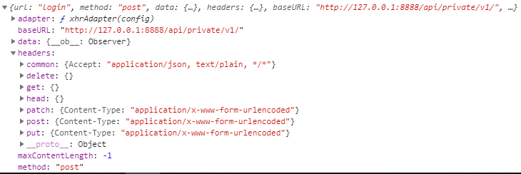

在 methods 中定义 getAsideList() 获取数据函数

```js
async getAsideList() {
    const { data: res } = await this.$http.get("menus");
    this.asideListArry = res.data;
}
```

在 created 生命周期函数中 调用上述函数

```
created() {
    this.getAsideList();
  },
```


##### 展示Users.vue

在 components -> user -> 创建 User.vue

将 User.vue 导入 router -> index.js 中，并配置路由规则

##### 根据路由设置高亮导航元素

在 data 中定义 defaultActive 属性，记录当前展示的路由地址

将 defaultActive 记录的数据绑定到 el-menu 的 :default-active="defaultActive"

在created中记录当前被点击导航的路由地址

在created中添加以下代码

```js
// 每次刷新 重新渲染的时候设置当前路由为默认选中项
this.defaultActive = location.hash.slice(1)
```

通过vue侦听器 侦听路由状态，改变同步改变 defaultActive 的值

##### Users.vue 组件 视图布局

添加面包屑导航 el-breadcrumb

添加 卡片视图组件 el-card

在 el-card 中添加栅格布局容器

第一个栅格添加带按钮的搜索框 el-input

第二个栅格添加  添加用户 按钮

##### axios 发送数据请求 获取用户数据


用户列表的索引有两种解决方案

方案一：computed计算属性计算每页的起始索引，通过属性绑定，将计算属性return的值绑定给 index :index="计算属性"

方案二：通过属性绑定，绑定index的重计算方法indexMethod  并在methods中定义处理方法

```js
indexMethod(index) {
        return (index+1)+this.queryInfo.pagesize*(this.queryInfo.pagenum-1);
      }
```

问题解决

密码校验规则需要优化

当用change表单校验的时候 不需要设置关闭事件也可以

待解决

每页显示数据多的情况下，限制组件内滚动


技能

利用插槽封装组件--2-27晚上
